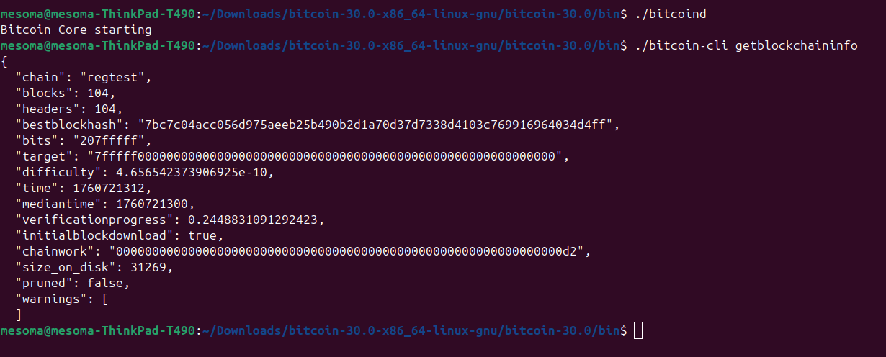
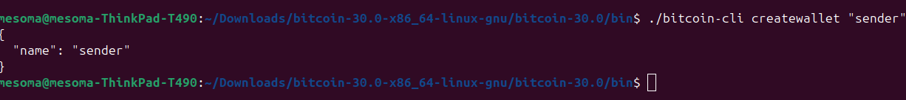
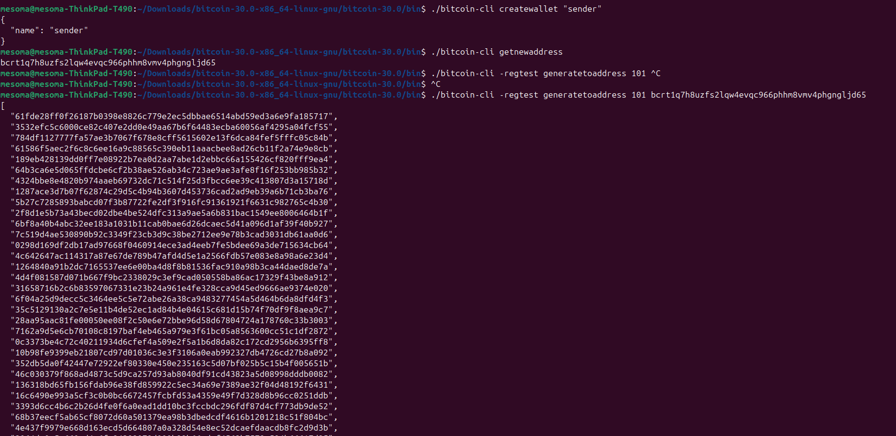
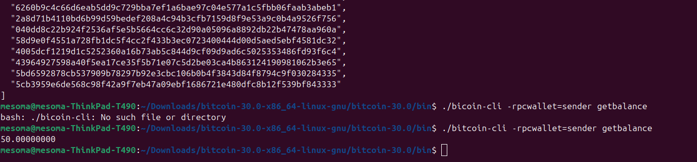
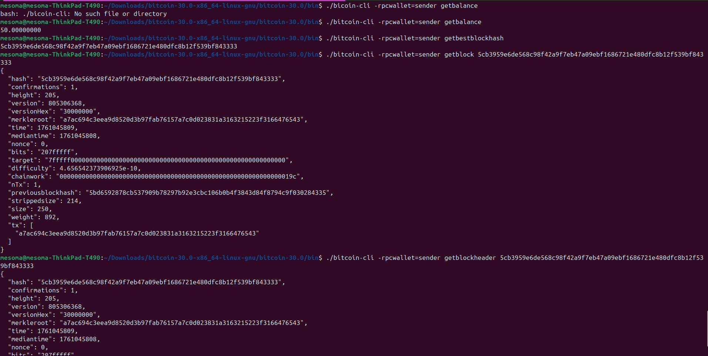
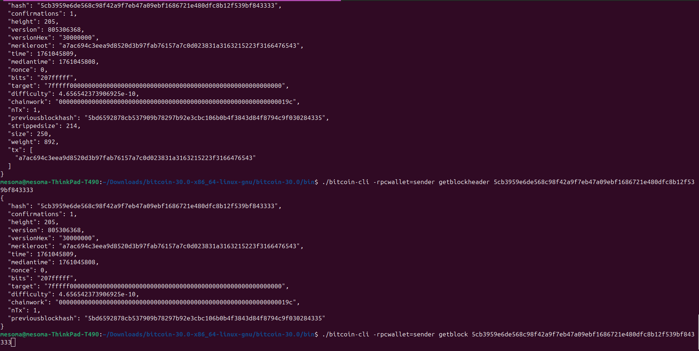
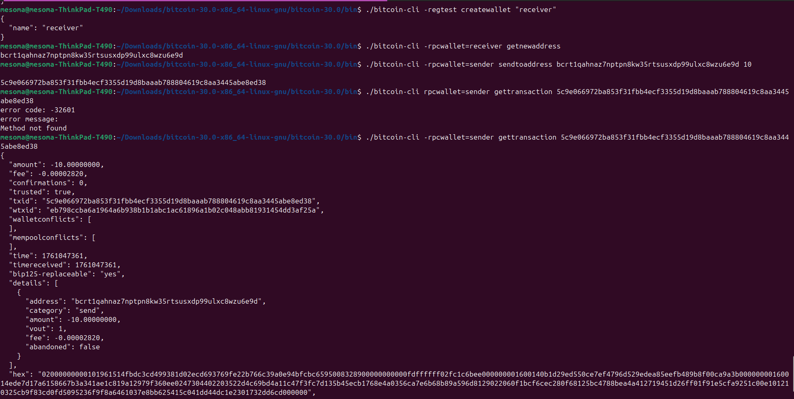
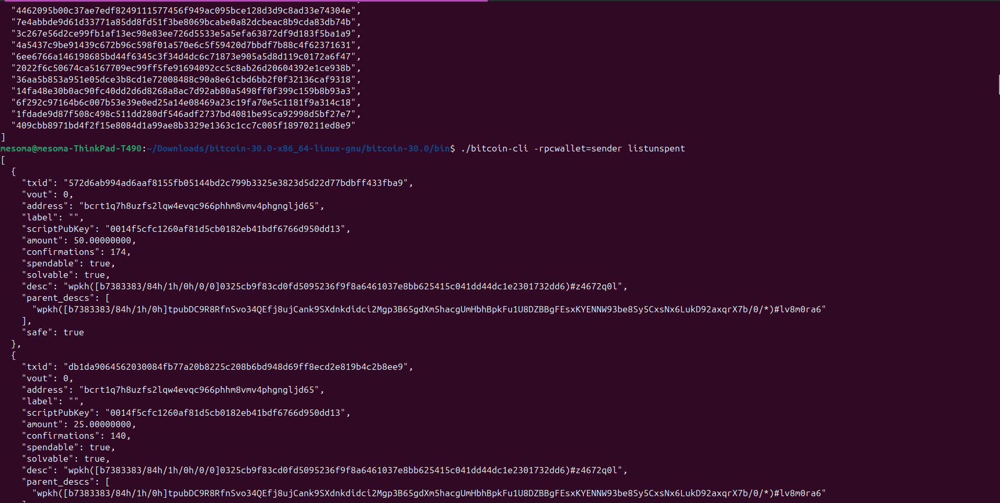

### -Submission_Week 1 
*Learning the fundamentals on Bitcoin
During week one our focus was on fundamentals of Bitcoin and how to setup the bitcoin core on my device.

This week I was able to:

- Run a Bitcoin node in regtest mode,
- Explore blocks, transactions, and the mempool,
- Simulate simple transactions between wallets,
- Understand how UTXOs power Bitcoin.


## Setting up bitcoin core

Setting up bitcoin core on my machine through the following steps:

- Download the gzip from the [official website](https://bitcoincore.org/en/download/).
- cd to Downloads then run
  ```bash
  > cd Downloads
  ~./Downloads > tar -xzf (file_name)
  ```
- Then run:
  ```bash
  > sudo install -m 0755 -o root -g root -t /usr/local/bin bitcoin-30.1/bin/*
  ```
  This command copies the extracted files from the g-zip to the local user binary folder so it can get globally executed.
- To confirm if everything is fine, run bitcoin-cli --version as in the image below:
- Next is to create a default bitcoin directory in our root folder and also create a default _bitcoin.conf_ inside the directory:

  ```bash
  > mkdir ~./bitcoin
  ```

  The conf file would contain the configurations on which the bitcoin daemon would run

- To create the configuration file, run the following command:

  ```bash
  > vim ~./bitcoin/bitcoin.conf
  ```

  You can either use vim or any preferred text editor.
  When the editor opened, I added the following config:

  ```text
  regtest=1
  daemon=1
  ```

  Setting our environment to regtest and to run the daemon in development mode

- Next is to run the bitcoin daemon using the following command:

```bash
> bitcoind
```
- This confirms the whole setup.
### -Verifying the Node

First, I verified that my Bitcoin node was running correctly in regtest mode:

```
bitcoin-cli getblockchaininfo
```

I checked that the `chain` parameter showed `regtest` and noted the current block height.



### Creating wallet

A Bitcoin wallet is like your digital money bag that stores your keys, not your coins. Now u will be wondering where ur coin is been stored, it is stored in the blockchain <br > Source: ChatGPT

To generate a bitcoin wallet on the bitcoin cli:

```bash
> bitcoin-cli createwallet "sender"
```

The terminal should output something like:

```json
{
  "name": "sender"
}
```


### Get a Wallet Address

>To retrieve the wallet address that was created as seen above I used the getnewaddress and it brought out or displayed the wallet address of the wallet "sender"

```bash
>bitcoin-cli getnewaddress
```
The command returns the info about the wallet address


### Generate Blocks

> To generate blocks to a specific address we run the following code:
```bash
> bitcoin-cli generatetoaddress 101 "$(bitcoin-cli -regtest getnewaddress)"on the bitcoin cl
```


> Running getbalance shows you the current cbalance of the address after it has generated new blocks and compiled


### Exploring the blockchain
> To explore the blockchain, we run some commands like:

> The getbestblockhash Returns the hash (ID) of the most recent block in the best (longest/most-work) blockchain.

- getbestblockhash:
  Returns the hash of the best (tip) block in the most-work fully-validated chain.
  

>The getblock Returns all details about a block, given its block hash.

- getblock <blockhash>:
Returns information about the block specified


>The getblockheader is a Bitcoin Core RPC command that gives you summary information about a block — but only its header, not the full list of transactions.Work with Wallets: Get cWork with Wallets: Get comfortable managing multiple wallets and addresses.omfortable managing multiple wallets and addresses.

- getblockheader <blockhash>:
Returns a full summary of information of a block


### Work with Wallets: Get comfortable managing multiple wallets and addresses.
- I crgenerated another bitcoin wallet on the bitcoin cli called "receiver":

```bash
> bitcoin-cli createwallet "receiver"
```

The terminal should output something like:

```json
{
  "name": "receiver"
}
```


```bash
>bitcoin-cli getnewaddress
```
This command  above returns the info about the wallet address


### Sending and Tracking Transactions:

To send coins between addresses, we use sendtoaddress

```bash
>bitcoin-cli  -rpcwallet=sender sendtoaddress "recipient_bitcoin_address" amount "optional_comment"
```
Added this config to the bitcoin.conf file

```text
fallbackfee=0.0002
txindex=1
```
The command returns the transaction hash


To check the transaction details, we run gettransaction


### 6. Inspect UTXOs: Send and Track Transactions: 
- To get all the information about all your spendable outputs of the mined blocks under the senders address we use the listunspent.
- Record details like txid, vout, and amount.

```bash
>bitcoin-cli -rpcwallet=sender listunspent
```

To check the transaction details, we run listunspent



