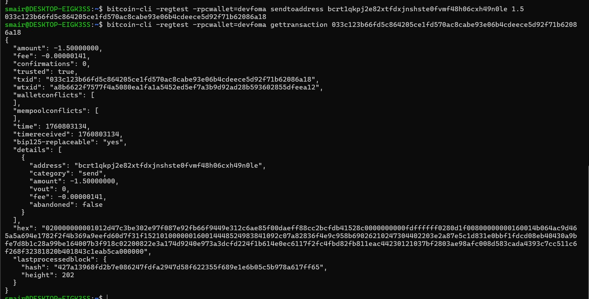

# Week 1 Focus — Bitcoin Fundamentals
Before diving into Rust, we’ll start with understanding Bitcoin from first principles. By the end of this week, you should be able to:
- Run a Bitcoin node in regtest mode
- Explore blocks, transactions, and the mempool
- Simulate simple transactions between wallets
- Understand how UTXOs power Bitcoin

### 1. Verify Your Node Setup: Ensure your node is correctly configured and responsive via CLI.
Confirm your Bitcoin Core node is running in regtest mode.
- Run `bitcoin-cli getblockchaininfo` and note the chain and blocks values.

### my solution: 

### 2. Generate Blocks: Understand block creation and coinbase maturity on regtest.
- Use the command below to generate 101 blocks to a new address:
`bitcoin-cli -regtest generatetoaddress 101 "$(bitcoin-cli -regtest getnewaddress)"`
- Verify the new block height with getblockcount.

### my solution:

### 3. Explore the Blockchain: Learn the structure and metadata of Bitcoin blocks.
Use these commands to inspect your chain:
- `getbestblockhash`
- `getblock <blockhash>`
- `getblockheader <blockhash>`

### my solution:

- `bitcoin-cli -regtest getbestblockhash`
- `bitcoin-cli -regtest getblock 4f1656195a06cdeff9454e73ef737a863048f9965bb61f046cd641725d0e210d`
- `bitcoin-cli -regtest getblockheader 4f1656195a06cdeff9454e73ef737a863048f9965bb61f046cd641725d0e210d`

### 4. Work with Wallets: Get comfortable managing multiple wallets and addresses.
- Create a new wallet: `bitcoin-cli -regtest createwallet "testwallet"`
- Generate a few new addresses and list them.

### my solution:

### 5. Send and Track Transactions: Learn how transactions are created, broadcast, and confirmed.
- Send test coins to a new address using sendtoaddress.
- Retrieve the transaction using gettransaction.

### my solution:

## Step 1: Generated a new addrees in one of my newly generated wallets (devfoma)
 `bitcoin-cli -regtest -rpcwallet=devfoma getnewaddress`

## Step 2: Mined 101 block from devfoma wallet
 `bitcoin-cli -regtest -rpcwallet=devfoma generatetoaddress 101 bcrt1qq0vaelgaldeht2dcck7j9rpluth8gcv05h9p4k`

## Step 3: Checked my balance with -
 `bitcoin-cli -regtest -rpcwallet=devfoma getbalance`

## Step 4: Generated a new address for my recieving wallet (mywallet)
 `bitcoin-cli -regtest -rpcwallet=mywallet getnewaddress`

## Step 5: Sent 1.5 BTC test coins to mywallet from devfoma
 `bitcoin-cli -regtest -rpcwallet=devfoma sendtoaddress bcrt1qkpj2e82xtfdxjnshste0fvmf48h06cxh49n0le 1.5`

## Step 6: Checked the metadata of the transaction
 `bitcoin-cli -regtest -rpcwallet=devfoma gettransaction 033c123b66fd5c864205ce1fd570ac8cabe93e06b4cdeece5d92f71b62086a18`

 

### 6. Inspect UTXOs: Send and Track Transactions: Understand how UTXOs represent spendable Bitcoin
- Use `listunspent` to view your spendable outputs.
- Record details like txid, vout, and amount.

### my solution:

 `bitcoin-cli -regtest -rpcwallet=mywallet listunspent`

 

### 7. Decode a Raw Transaction: Deepen understanding of Bitcoin’s transaction model.
- Fetch a transaction with `getrawtransaction <txid>` true.
- Explore the input/output details and note the structure.

### my solution: 
 `bitcoin-cli -regtest getrawtransaction 033c123b66fd5c864205ce1fd570ac8cabe93e06b4cdeece5d92f71b62086a18 true 31beda7dd6ad73a3e21c1d0d6a3f43d3f6bffb970e6eb0c1b28519eaee881a19`

### 8. Simulate a Payment Workflow: Experience the full transaction lifecycle in regtest.
- Create two wallets: `sender` and `receiver`.
- Send BTC from one to the other and confirm the transaction by mining a block.

### my solution:

All steps in number 5

## Step 1: Mined a new block to confirm the transactions
 `bitcoin-cli -regtest -rpcwallet=devfoma -generate 1`

## Step 2: Confirmed the transaction
 `bitcoin-cli -regtest -rpcwallet=devfoma gettransaction 033c123b66fd5c864205ce1fd570ac8cabe93e06b4cdeece5d92f71b62086a18`

## Step 3: Confirmed that the recieving wallet (mywallet) got the btc
 `bitcoin-cli -regtest -rpcwallet=mywallet getbalance`

