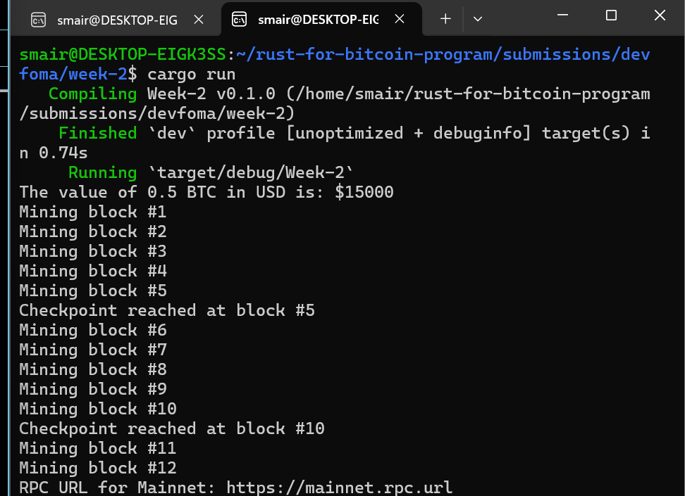

# Week 2 — Rust Fundamentals: Reflection and Summary

## Project Structure

This week’s assignment was organized into a modular Rust project, where each task was implemented in a separate file for clarity and reusability.

```
src/
├── main.rs
├── task_1.rs
├── task_2.rs
└── task_3.rs
```

**main.rs** — Serves as the program entry point. Integrates all tasks and demonstrates function calls from each module.
**task_1.rs** — Contains a function for calculating the value of Bitcoin in USD.
**task_2.rs** — Implements control flow and looping logic to simulate mining blocks and reaching checkpoints.
**task_3.rs** — Defines an enum and a pattern-matching function for selecting and returning network configurations.

This modular setup ensured clean separation of concerns, easy debugging, and scalability as more features are introduced in future weeks.

### my implementation for all tasks




## Reflection: Summary of Learning and Debugging Process

### What I Learned

This week focused on developing a deeper understanding of **Rust fundamentals** through practical, Bitcoin-oriented exercises.
I learned how to structure a Rust project modularly using multiple files, apply control flow, and implement functions and enums effectively.

Specifically, I learned how to:

* Define and call functions with parameters and return types.
* Use **expression-based returns** to write concise and efficient code.
* Apply **loops** and **conditional logic** to simulate real-world processes such as block mining.
* Structure code across multiple files using `mod` and `pub` for modularity and reusability.
* Implement and use **enums** with **pattern matching** to manage different system states and configurations.
* Organize logic in a clean, readable way while maintaining functional separation between modules.

By completing these tasks, I gained confidence in writing Rust code that is both functional and scalable, while also reinforcing the importance of modular architecture in system-level development.


### Challenges Faced

1. **Understanding the `mod` and `pub` Relationship**

   * Initially, I encountered visibility errors when trying to call functions defined in other files.
   * **Cause:** Functions were not marked as `pub`, making them private to their modules.
   * **Solution:** Used the `pub` keyword to make functions public and accessible across files, and ensured that `mod filename;` was correctly declared at the top of `main.rs`.

2. **Borrowing and Ownership in Function Calls**

   * Some initial confusion occurred when passing references (`&`) versus owned values.
   * **Cause:** Functions like `get_rpc_url()` expected borrowed references, not owned data.
   * **Solution:** Reviewed Rust’s ownership and borrowing rules and passed references using `&` when necessary to satisfy the borrow checker.

3. **Debugging Module Import Errors**

   * Encountered `unresolved import` and `cannot find module` errors during file organization.
   * **Cause:** File names and paths did not match the module declarations in `main.rs`.
   * **Solution:** Ensured all task files (`task_1.rs`, `task_2.rs`, `task_3.rs`) were correctly located in the `src/` directory and declared with matching module names.

4. **Output Formatting and Readability**

   * Initially, printed outputs from different tasks looked disorganized.
   * **Solution:** Added clear print statements and separators to distinguish outputs from each task, improving readability during testing.


### Debugging Approach

Throughout the exercises, I focused on understanding **why** errors occurred rather than just fixing them quickly.
My debugging strategy included:

* Reading compiler error messages carefully to identify the root cause.
* Checking for visibility and scope issues when working across modules.
* Running `cargo check` frequently to validate the project before execution.
* Making small, incremental changes and verifying outputs after each modification.
* Consulting the official Rust documentation and examples to confirm syntax and best practices.

This systematic approach helped me become more confident in reading compiler feedback, structuring projects, and managing modular dependencies effectively.


### Key Takeaway

This week’s exercises were instrumental in building a strong foundation for developing Bitcoin-related systems in Rust.
By implementing functions, control flows, and enums within a modular architecture, I now understand how to design structured, maintainable Rust applications.

The process improved my ability to debug logically, manage visibility across modules, and structure programs that can scale into larger projects.
Most importantly, it bridged the gap between theoretical syntax learning and **practical system implementation**, setting the stage for more advanced topics such as **ownership, borrowing, and data structures** in the coming weeks.
