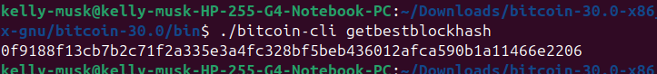

## faced tactical issues buh i made it sucessfully 

### 1. Verify Your Node Setup: Ensure your node is correctly configured and responsive via CLI.
Confirm your Bitcoin Core node is running in regtest mode.
- Run `bitcoin-cli getblockchaininfo` and note the chain and blocks values.

## 2. Generate Blocks: Understand block creation and coinbase maturity on regtest.
- Use the command below to generate 101 blocks to a new address:
`bitcoin-cli -regtest generatetoaddress 101 "$(bitcoin-cli -regtest getnewaddress)"`
- Verify the new block height with getblockcount.

## 3. Explore the Blockchain: Learn the structure and metadata of Bitcoin blocks.
Use these commands to inspect your chain:
- `getbestblockhash`
- `getblock <blockhash>`
- `getblockheader <blockhash>`

### 4. Work with Wallets: Get comfortable managing multiple wallets and addresses.
- Create a new wallet: `bitcoin-cli -regtest createwallet "testwallet"`
- Generate a few new addresses and list them.

### 5. Send and Track Transactions: Learn how transactions are created, broadcast, and confirmed.
- Send test coins to a new address using sendtoaddress.
- Retrieve the transaction using gettransaction.

### 6. Inspect UTXOs: Send and Track Transactions: Understand how UTXOs represent spendable Bitcoin
- Use `listunspent` to view your spendable outputs.
- Record details like txid, vout, and amount.

### 7. Decode a Raw Transaction: Deepen understanding of Bitcoin’s transaction model.
- Fetch a transaction with `getrawtransaction <txid>` true.
- Explore the input/output details and note the structure.

### 8. Simulate a Payment Workflow: Experience the full transaction lifecycle in regtest.
- Create two wallets: `sender` and `receiver`.
- Send BTC from one to the other and confirm the transaction by mining a block.

