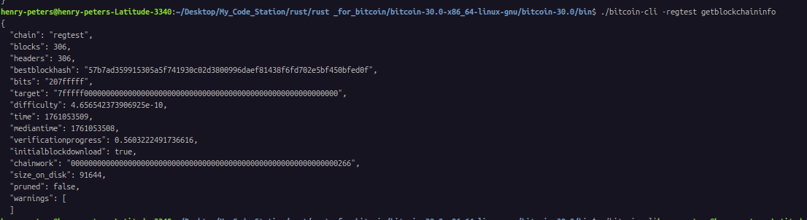
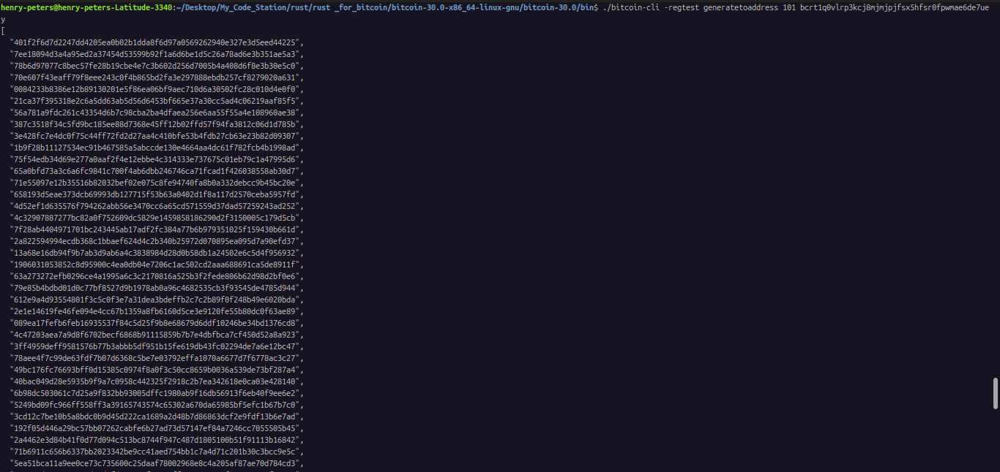
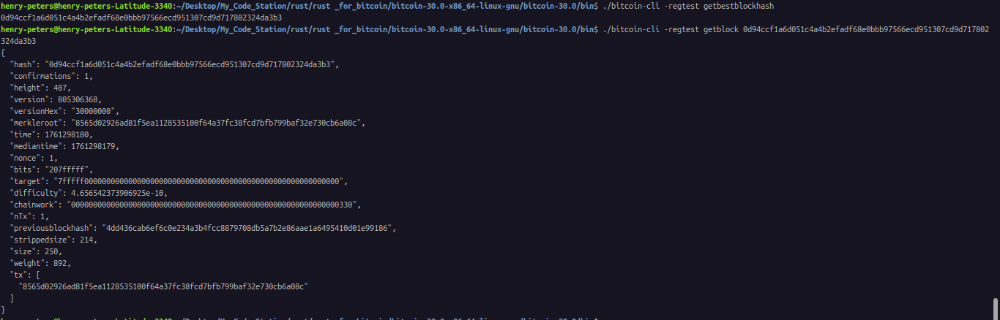
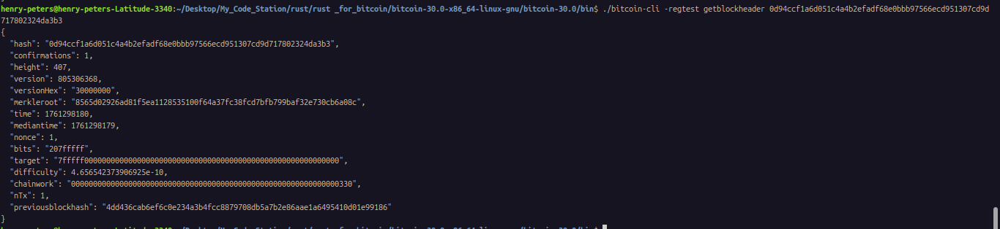
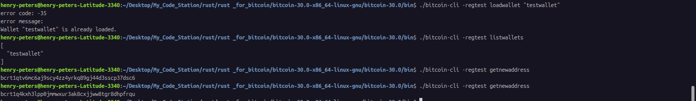
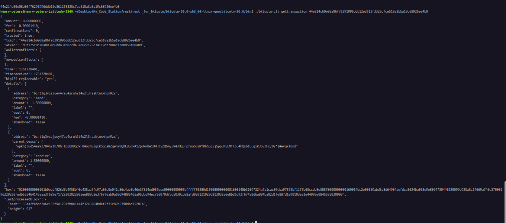
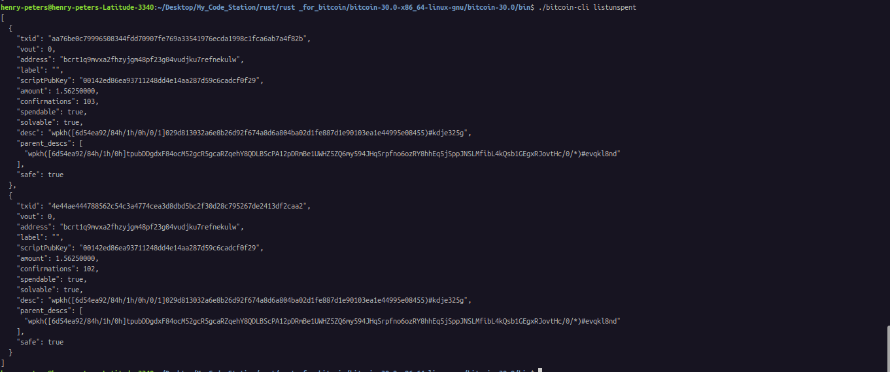

<!-- 2

- ```powershell

henry-peters@henry-peters-Latitude-3340:~/Desktop/My_Code_Station/rust/rust _for_bitcoin/bitcoin-30.0-x86_64-linux-gnu/bitcoin-30.0/bin$ ./bitcoin-cli listreceivedbyaddress 0 true
[
  {
    "address": "bcrt1qhpf8g9julearpetg0c9d3qp98e89lnxgdn5r3n",
    "amount": 0.00000000,
    "confirmations": 0,
    "label": "",
    "txids": [
    ]
  }
]
henry-peters@henry-peters-Latitude-3340:~/Desktop/My_Code_Station/rust/rust _for_bitcoin/bitcoin-30.0-x86_64-linux-gnu/bitcoin-30.0/bin$ ^C
henry-peters@henry-peters-Latitude-3340:~/Desktop/My_Code_Station/rust/rust _for_bitcoin/bitcoin-30.0-x86_64-linux-gnu/bitcoin-30.0/bin$ ./bitcoin-cli generatetoaddress 101 bcrt1qhpf8g9julearpetg0c9d3qp98e89lnxgdn5r3n
[
  "495d50791375d102cbc59e3a0a1174192a19f14243fa3201d879d089331729bb",
  "7f60e4445bb6a37db1928fa3e761556b6db4119c4e0a00d8d7bd035241f4b50f",
  "6e076defc5164a0bb79a25d4b850854d0dea1fe2bead2a039afc2dbd3af099b5",
  "6e29ad413928eda14fcbc48dfac3a6afce74c23d10569810c588791606e5a402",
  "14b21663639e18a21740e292181d6a0525aa11a53900a74a83e9230fe95d5fc0",
  "3b2b7890042d18afcd7819e7075bda91d2e583511770eda2f9d14b0a59981e28",
  "084266ad14c502daba68b1b044b6a8ea260749323cec4f4988b1e2e6a02722e2",
  "6cd9894515051ab59501253b4f6411abac8eafb716f5daf6f92ae41897a90df8",
  "3518034b19324c659915fac5025820ebe99b8535393dc0050b55fdd0c9f56c82",
  "2361828b056d755b8029f27b149e035f07b585d83062349460b7a909560b3c62",
  "36e7704a0161bb1fbe06211fe8d8edbce064ba7b929c78581c911593cacef290",
  "45f854207c56c1e6c7a8f4cc5c36dffdbdeb131ce74faff870bbc750e2de0c50",
  "57cdf4816a603ba4a7ee1eee79b6f77534fe136cb1ee61424c6a6ea34446b899",
  "03c16c96ead68f0f1340be8bfdecde4b12765107e643fd4483f40500d9a6177f",
  "092eec586f8728a1f4c32f12863e215a4746a6e43dff071b639ecd5813555065",
  "5dcd249d1fcb2c91b84156560f0377083a5d90571361874a78201d33026e0810",
  "09fdcac7270eb194960b67910f083a17c584da02522042b0b76e10782d9ac900",
  "7f42dffc78c8fe4ac750a0b355857b51fa189d917528fe26a2cd2fb14809ccfa",
  "22cf1e38971c53ba6726484a80efe0488e495631d5bde450f508bf06fbc256af",
  "78981338af9ad779707cfd1f6ba7f7b2a0a4d530d4a9205cf982d7380f483816",
  "35fa8bed9611256eb8c3619d5292b7636b33d6841226e9efd0508f593746a131",
  "3a619b11f2dbb8562038ab2d7bf4da91f493961d8ad587bd53ecd098bafc01f6",
  "3b57fc724cce737ac320cb2a8a6bec61dfc62ab1afad6fe3225362e74ed274a0",
  "7361f3674aa8205321f043abfa2dcf354a500a765764cb92dd7c250fd74d995c",
  "44d9fd8427a01303bead617cd3e5b02452ccf20d66560380e2a028369a2e284d",
  "7269cf088b5f0f7f17a1fdfa042384d3c9e95c9e738a86f090993e932137fb5d",
  "7fc309fed820d704ee52eb20624e7ae40cd8b605ecad9f06383f012d87e40df5",
  "4b5d34d583caa1e204c02654a648f449b71f3daa7df85fd778d2a2f5d977050d",
  "703724b24117995e66a3b1ac30695269de15921527d7b9dbf36da2dbf6f01ea1",
  "121e2ee5a7b7eb5cb6dc88377a704fafdf5cd7a04ae8d926ae3a67edc08511de",
  "15db5d7d4e5ff2198833e81f79959b4b5864d9103c16b22fdedf2770f657131d",
  "21f65fca5edd389c400b94746b9cc6b8cbd846e75ace2d4230e34e6b42b5bdc6",
  "1298c41c7ee47a793293a9f8c261c86d092bb09fd01d39f99d67ef5156755256",
  "280e6cfba87b9ab6d8a2b8b647cc37778659c22e01be176b668a3b4ab93f70e8",
  "44811b84c92f8dd0540914fa91dae1fa6ca6d208f0b1137b72ca733d8985e25a",
  "0bd30115a2389257b254b44384cdf3bcde813ece8571e37cc968d56ea8148389",
  "5d67fb10fb4a7f314875234fa49004e12b647d31cf3f493a777ef2ffd6c38ee6",
  "149bd96de5598f1f536852864aa1cfe91a857cfe7e1900ae53353b71653c593a",
  "2ac3569e208a993c18d8d2d23014ee6c41712ed99e50d8ab2b87c15c851f1cec",
  "182fe8590d069ab1cdd48b4a083c08c71937702b6c0fd492f16b69f06e3a98b0",
  "297c7a07f89e6d9ed3ad9416ae093f7c861d54f95013ac14887b57e5d86bf88c",
  "2402faca46dd43d2bc32e6945d42c179d518c3070c8fea9940280fdbced90f5d",
  "014f6682edc19addda6b60a22642453a89b48a43d6b3dc77337e3fe69d765d4a",
  "511e3cba0ba73e1bd42278df067c67079fab1193176599da3a50dddd5c8acef3",
  "1ed71aca044bfe875b9a928ceeaf337366ac04c556cf06079ecc885a0f5edeac",
  "507d80a940d83cb5a08a7aa672352c5726eb69ee644a3e43ad8f11850ca57d17",
  "642e6935961cbccb6fbe359e510d70ab665913464109487286ef9412af5f61da",
  "5fe81011304131f182dedb8dbd5105b97dd27eebca7f877a24458d850f84c162",
  "52d3a07a7b1296da00224d729a7c3eb734de829e895c5ff037e2981d4cc7b39c",
  "774d8fb3c5fce23ec4d2db9c8da26ada711134fe22bb78a90087600d2443c921",
  "4f67ea4dfe35ad9dd851d49f01482a34c9c8ecdb29612d2da7bdb80cc584ebbf",
  "7e1f780ff258c973b827e7d1aad16304fe484cb6ddee8016bab8aae83e2fdc8f",
  "664752d89387a4e058293455fb1b629b8d768daab4d6ccb3dabfc944d5c3b332",
  "5e23f6c0277ba76e1eea65eb4c7412a0c0796b788c4451f248fdcf091b36152a",
  "5c8d92c604490a2c3b11c64cfa8d0c370dd2984493f75946c236db951c173bc8",
  "30c3be303f80667990dd8d5d83b91e2538b61581ffaf409d41e5423ebc3a0902",
  "4cb70fd4e3da0cd9536a76468c9ef74b42a9aae2655f79c3c402f0570e43f577",
  "09b91d62ba1bfba7c083f764b9d5e7978a7ba81858d3af55322adf4657b83385",
  "347e37771ead5fde09ec273c2623ed783adbc842c4b66213d5d1e2302f9d3ed5",
  "4b11f5ed131e5a962f9eb2d9f7a90993c0ba75d4a72636b1c60564ac94abc248",
  "527061e23ae159a2c7a58de45addd07726de55395ef21b2e5849e4537af6217c",
  "58876d3638ae2ae4773a0d02b1aa2860f51c018ff07e7d1be4973206a6ff928f",
  "14c47045a4cea12bfe64b79f1232af1430ae957253bd74d81ef28894c019448c",
  "2336c6eaedd506ec66eb44b9b8593a20f3801f34d239e0942f18546db8005aaa",
  "3141bb8b522ab09dd044352c18f06716d49dfca904fb55bbcdf8e220c8a3ba04",
  "31afb3aface6acf97038fcdfadd698fc0e13b1738ff3a8b2be40881562a5a521",
  "3a689f0eb4c53206755619bfc16a4f8d8959b40f05c6292dbda83c8ee884759e",
  "22ad6a0f6c1d3005abf61b302afe4239a8b6bac0bea78119c1ccc81c0bc2bb23",
  "5073a29c54089ffdf42f6eaca01873560dc0f5248f3b164f60190e1e09b477cd",
  "48c546daf6da2badf9cca7788b13f26fd5d97d9a8f44452c30632c5716a9fa64",
  "3c80fc6af30b0028d9d3e805bda05643d680d59dad876045afcc1963b0bc61d3",
  "3e861f142a85166d7aed00bb5c41a03d1f72bb2a117bc2a0e8e7606315105c28",
  "63c504f0196325ee8f68665be5867de5db4ff76d55766ab9a840a1de1f798500",
  "5822329d2c0a20a39487c700897eda5a8024ed422609786379157f079b46ff4b",
  "3367d0334ac756f8269d232355bdcbda5b922440a795326d6753f6b0cc523301",
  "5cdbe08544fa210860230333fd93342e4ed3dc7c0c9e420362a6299ccd172e7c",
  "037cccb8b213bf6562df94321ec5f4de4cba4e9cf2d09b64e69ba54da10f5ab1",
  "0109545df9d26e1838969dea53d05ead0eaf37c6aef7a962a27565bf520eb512",
  "41e960095a7a0c02eadefb7a10e38d45ec1cc75d2007ff83e6aeb974f8e9f16c",
  "68301797757fc1e95f6e65f56f68285b1bb2518e391d89f60ebf1cc1170232d9",
  "0a263df13b4610eb38cb9a579eea630a6a70f790f0e9f000bbe6bf398e524a50",
  "61c4fc3d357b4ff54884844c0ce7b14e471744c759523b8c077da2e1bdd63498",
  "493e2dfb54a222157360598bcd402798542ccb3da656d7d479ef47ed8de20ec9",
  "6992244e4d96f053009ca56460a8bb832126a23ba7d859ebb306af279c65fbbf",
  "31cd9f3acd584b4f682dd7c3171c57190993d2b66d6a2849fb7a8c27494cdfc6",
  "4cf323c4347fdae839bcf75ad691b79393108039c0dea1474ad97e51fa0c262f",
  "40a7cda13cfa62b3e96e268cca44145ad98bccd9803070f81f6c52c1d698abc3",
  "7cd2953913df719aa3c5fdc42be6a7682509c240dd24bf9df19b5723e9eda077",
  "23673a7e0e998fcf4a592b0e5c8806d8361249dbc777a4a357f43745546ff80d",
  "1009c8d0792f535f8818113b90450852cb71090f22dc909cd72aff84ac4b7b13",
  "0300d9a1940be7106d92186afec13a6c17ff6d9af199b9b8c0cfe969fe7958da",
  "22fbe814634371477f8f81407b26266f0e6624ab062cd4d10b053950a05e1146",
  "23ef7b62007155b55c4360a258498d645bd32bfaa593f5069c668dc431d5140a",
  "18081095fb37f65eed2a2271f1a5a2d55bbf8891c7f6bef09d52c505c6e03f1e",
  "001d0720468a2f9c63ea4d7abcefd853b1bb898d476bc0d96005712ad6e13a9e",
  "27f9a15e867495eb2fb5371b159ba7f813b917d0fe0c4dd74ea3799d6c4f04c4",
  "49d8d04372428ea482ef35ceda838be53b2c22741eb35749de27656a9b88539d",
  "4f7db9effa1364bf4537881a246acf82aac2097afc25c61755f6e04b4809e123",
  "071c359364be5318af845d9210a92845df2cf19917cdf792f4abc97209264c8e",
  "7c97ce705a15236e4f4ba2e0981d29996b5ee3a66b32fae20509d8bd2e6befa3",
  "45133a85b0bbd11563a4bc858d8ed03ea2ee11a5150f3642d15aac8787899ed6"
]
henry-peters@henry-peters-Latitude-3340:~/Desktop/My_Code_Station/rust/rust _for_bitcoin/bitcoin-30.0-x86_64-linux-gnu/bitcoin-30.0/bin$ ./bitcoin-cli getbalance
50.00000000

```
Explanation: 
In my wallet, I mined 101 new blocks and sent the block rewards (newly created bitcoins) to the specific address I provided.

- when I did this,
./bitcoin-cli -regtest getblockcount
The output is 
`101`


3
- bitcoin-cli -regtest getbestblockhash
This gives you a long string of letters and numbers called a hash.
The hash is like a fingerprint for the most recent block.
You need this hash to look up details about that specific block.

-bitcoin-cli -regtest getblock <blockhash>
Replace <blockhash> with the hash you got in step 1.
This shows everything about that block, including: hash, confirmation, height, tx, time, mediantime, nonce

-bitcoin-cli -regtest getblockheader <blockhash>
Gives just the “summary” of the block, without listing all transactions.
Key fields include:hash, height, version, merkleroot, time, difficulty, previousblockhash

4
-bitcoin-cli -regtest createwallet "testwallet"
Bitcoin Core creates a new wallet file under your data directory.
You can now store addresses, keys, and manage transactions in this wallet.

-bitcoin-cli -regtest -rpcwallet="testwallet" getnewaddress
bcrt1qzh69afn9vachf8vyqsf8z39w0qnzpmfghwnmvl
bcrt1qp9zwezv82h32pk8d8nm3rycdwy0ycq0ylfatz5
bcrt1qqfgum8g0gjjjap8ks68722ld90juxl573krd7m

-Bitcoin Core doesn’t provide a direct “list all addresses” command, but you can see all used addresses like this:
`bitcoin-cli -regtest -rpcwallet="testwallet" listreceivedbyaddress 0 true` -->


## Node Setup 
Verified that my Bitcoin node is running in regtest mode.

```bash 
./bitcoin-cli -regtest getblockchaininfo
```


## Block Generation
Generated 101 blocks to a new address to obtain spendable test coins.

```bash
bitcoin-cli -regtest getnewaddress
bitcoin-cli -regtest generatetoaddress 101 <my_new_address>
bitcoin-cli -regtest getblockcount
```

Output
407

> My chain now has 407 blocks in total.The first 100 blocks matured the coinbase rewards; I now have usable test BTC.

## Explore The Blockchain
Checked the latest block:

```bash
bitcoin-cli -regtest getbestblockhash
bitcoin-cli -regtest getblock <blockhash>
bitcoin-cli -regtest getblockheader <blockhash>
```
**Observations**


`getbestblockhash` asks your Bitcoin node `"what is the hash of the most recent block on the blockchain"`
`getblock` shows details like height, size, tx, previousblockhash, and confirmations.

`getblockheader` shows header-level metadata such as version, merkleroot, time, and bits.
It is a smaller summary of the block’s metadata. These commands helped me understand the structure of Bitcoin blocks. 

## Wallet operation
Created a new wallet named testwallet and generated addresses.
```bash
bitcoin-cli -regtest createwallet "testwallet"
bitcoin-cli -regtest listwallets
bitcoin-cli -regtest getnewaddress
bitcoin-cli -regtest getnewaddress
```
Output

Each wallet can manage its own set of addresses and keys.

## Transactions

Sent 1.5 BTC to a new address and checked the transaction details.
```bash
bitcoin-cli -regtest sendtoaddress <receiver_address> 1.5
bitcoin-cli -regtest gettransaction <txid>
```

## Output fields observed:

`amount`: -1.5 BTC (from sender wallet)
`fee`: small negative value (~0.00001 BTC)
`confirmations`: 0 (initially unconfirmed)
Transaction created and visible in the mempool until a new block is mined.

## UTXO Inspection

Viewed my spendable outputs with:
```bash
bitcoin-cli -regtest listunspent
```

Output
```bash
[
  {
    "txid": "a1234ef...abcd",
    "vout": 0,
    "address": "bcrt1qxyz...",
    "amount": 1.56250000,
    "confirmations": 103,
    "spendable": true
  }
]
```
Each UTXO represents a specific amount of Bitcoin that can be spent in a future transaction.

## Decode a Raw Transaction
Fetched and decoded a raw transaction:
```bash
bitcoin-cli -regtest getrawtransaction <txid> true
```
**Key parts:**
`vin` (inputs): references previous UTXOs by txid and vout.
`vout` (outputs): creates new UTXOs with specific amounts and addresses.
`hex` field: the serialized transaction data.
Understanding vin and vout clarified how Bitcoin transactions are chained.

## Payment Workflow Simulation
Created two wallets and simulated a payment.
```bash
bitcoin-cli -regtest createwallet "sender"
bitcoin-cli -regtest createwallet "receiver"

# get addresses
bitcoin-cli -regtest -rpcwallet="receiver" getnewaddress
bitcoin-cli -regtest -rpcwallet="sender" getnewaddress

# send 0.5 BTC
bitcoin-cli -regtest -rpcwallet="sender" sendtoaddress <receiver_address> 0.5

# mine one block to confirm
bitcoin-cli -regtest generatetoaddress 1 <any_address>
```

```bash

bitcoin-cli -regtest -rpcwallet="sender" getbalance
bitcoin-cli -regtest -rpcwallet="receiver" getbalance
```
Sender’s balance decreased by 0.5 BTC (+ fee); Receiver’s balance increased by 0.5 BTC after confirmation.


**What I Learned**
- How to run Bitcoin Core in regtest mode and generate blocks locally.
- The structure and metadata of Bitcoin blocks and transactions.
- How UTXOs represent spendable Bitcoin and enable secure transactions.
- How wallets create and broadcast transactions on the network.
