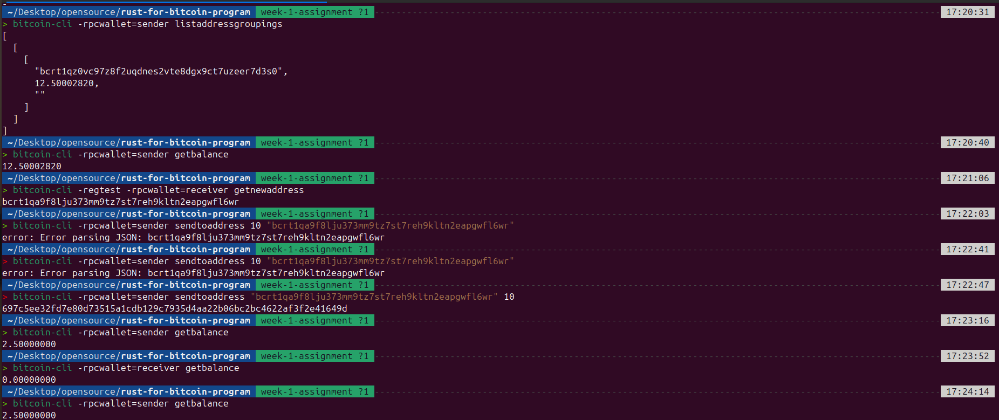

# Week 1 Submission

This week focus was on Bitcoin fundamentals and how to setup the bitcoin core on my machine.

This week I was able to:

- Run a Bitcoin node in regtest mode
- Explore blocks, transactions, and the mempool
- Simulate simple transactions between wallets
- Understand how UTXOs power Bitcoin

## Setting up bitcoin core

Setting up bitcoin core on my machine through the following steps:

- Download the gzip from the [official website](https://bitcoincore.org/en/download/).
- cd to Downloads then run
  ```bash
  > cd Downloads
  ~./Downloads > tar -xzf (file_name)
  ```
- Then run:
  ```bash
  > sudo install -m 0755 -o root -g root -t /usr/local/bin bitcoin-30.1/bin/*
  ```
  This command copies the extracted files from the g-zip to the local user binary folder so it can get globally executed.
- To confirm if everything is fine, run bitcoin-cli --version as in the image below:
  
- Next is to create a default bitcoin directory in our root folder and also create a default _bitcoin.conf_ inside the directory:

  ```bash
  > mkdir ~./bitcoin
  ```

  The conf file would contain the configurations on which the bitcoin daemon would run

- To create the configuration file, run the following command:

  ```bash
  > vim ~./bitcoin/bitcoin.conf
  ```

  You can either use vim or any preferred text editor.
  When the editor opened, I added the following config:

  ```text
  regtest=1
  daemon=1
  ```

  Setting our environment to regtest and to run the daemon in development mode

- Next is to run the bitcoin daemon using the following command:

```bash
> bitcoind
```

Your terminal should display something like:


- This confirms the whole setup.

### Creating wallet

A wallet is a container that contains private keys which can be used to generate multiple wallets. <br > Source: ChatGPT

To generate a bitcoin wallet on the bitcoin cli:

```bash
> bitcoin-cli createwallet "rustwallet"
```

The terminal should output something like:

```json
{
  "name": "rustwallet"
}
```

### Checking the blockchaininfo

The command returns the info about the blockchain

The image confirm that our blockchain in running in regtest and also the blocks already generated

### GenerateBlocks

> To generate blocks to a specific address we run the following code:
> bitcoin-cli generatetoaddress 101 "$(bitcoin-cli -regtest getnewaddress)"


> Running getblockcount shows you the current count of blocks in the entire wallet


### Exploring the blockchain

> To explore the blockchain, we run some commands like:

- getbestblockhash:
  Returns the hash of the best (tip) block in the most-work fully-validated chain.
  

-getblock:
Returns information about the block specified


### CHecking addresses and balance

- getbalance: Returns the balance(amount of btc granted) per wallet loaded.
  

The balance after generating 303 blocks is 3750

### Transactions

To display created addresses, we run listwalletgroupings


To send coins between address, we use sendtoaddress

```bash
>bitcoin-cli sendtoaddress "recipient_bitcoin_address" amount "optional_comment"
```

To resolve this error


Add this config to the bitcoin.conf file

```text
fallbackfee=0.0002
txindex=1
```

The command returns the transaction hash


To check the transaction details, we run gettransaction


TO decode a raw transaction, we run getrawtransaction


### Simulating a payment workflow




