### 1. Verify Your Node Setup: Ensure your node is correctly configured and responsive via CLI.
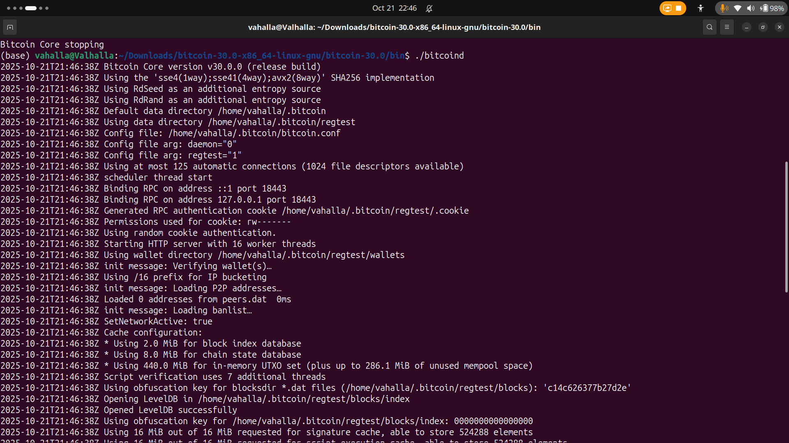

### 2. Generate Blocks: Understand block creation and coinbase maturity on regtest.
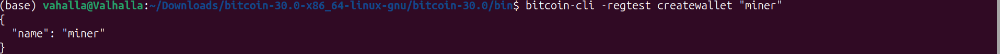
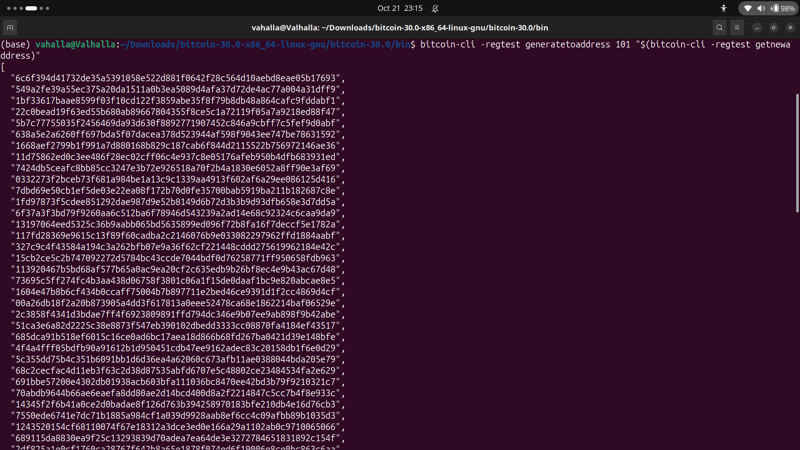
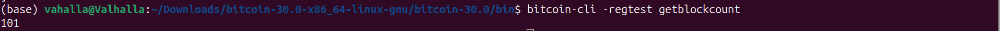

### 3. Explore the Blockchain: Learn the structure and metadata of Bitcoin blocks.
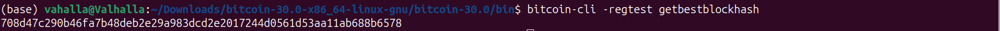

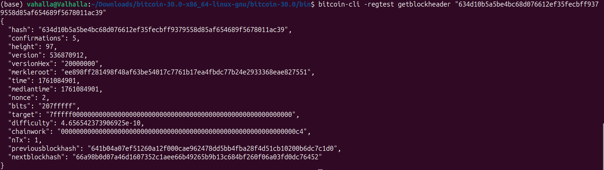

### 4. Work with Wallets: Get comfortable managing multiple wallets and addresses.

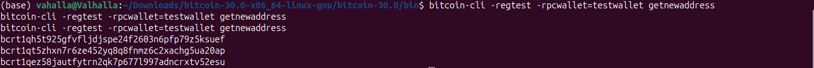

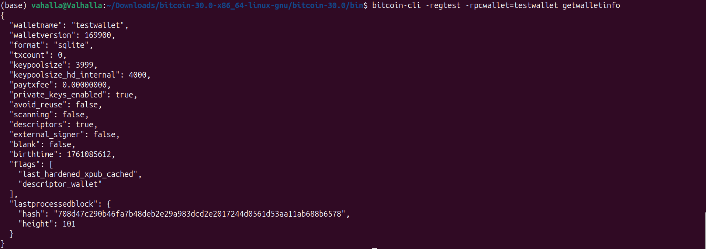

### 5. Send and Track Transactions: Learn how transactions are created, broadcast, and confirmed.
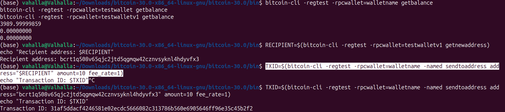
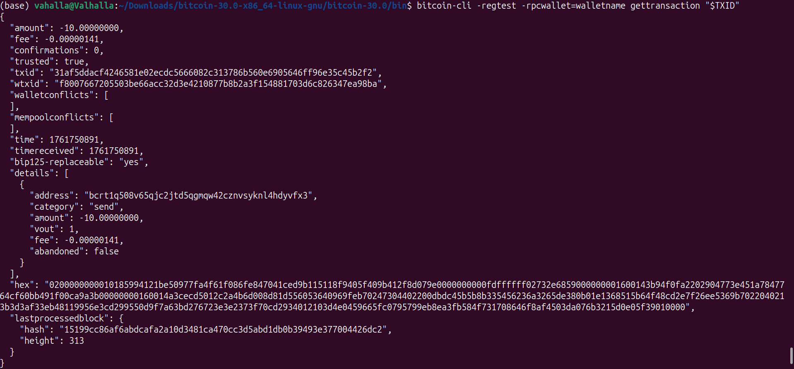

### 6. Inspect UTXOs: Send and Track Transactions: Understand how UTXOs represent spendable Bitcoin
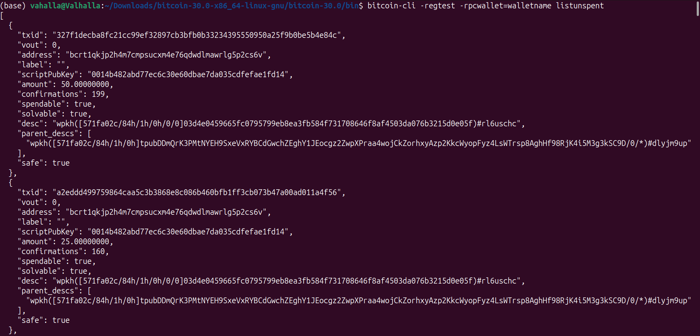

### 7. Decode a Raw Transaction: Deepen understanding of Bitcoin’s transaction model.
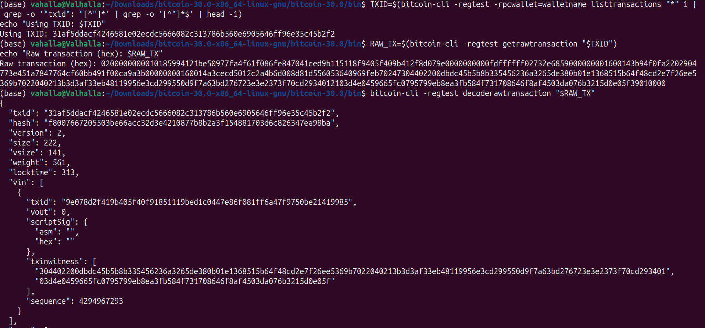

### 8. Simulate a Payment Workflow: Experience the full transaction lifecycle in regtest.
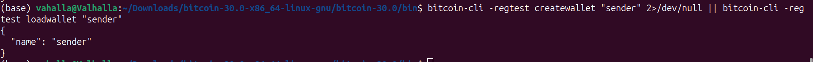
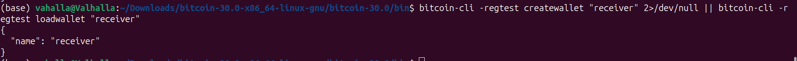
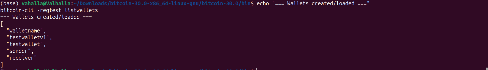
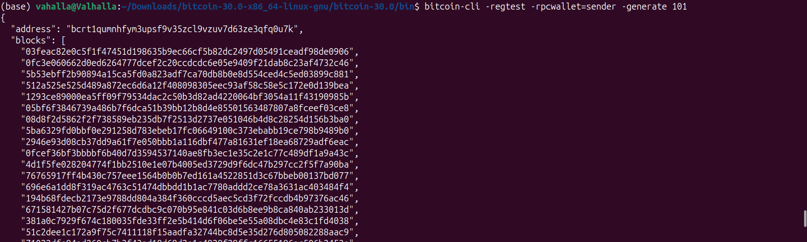
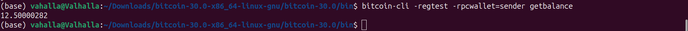
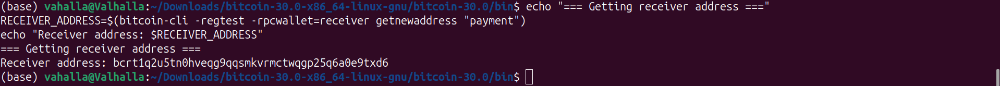
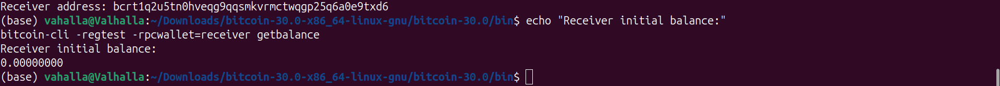
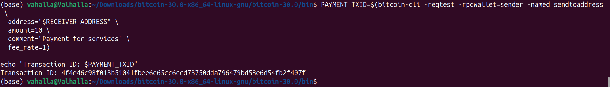
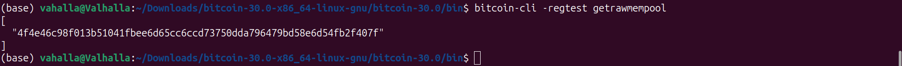
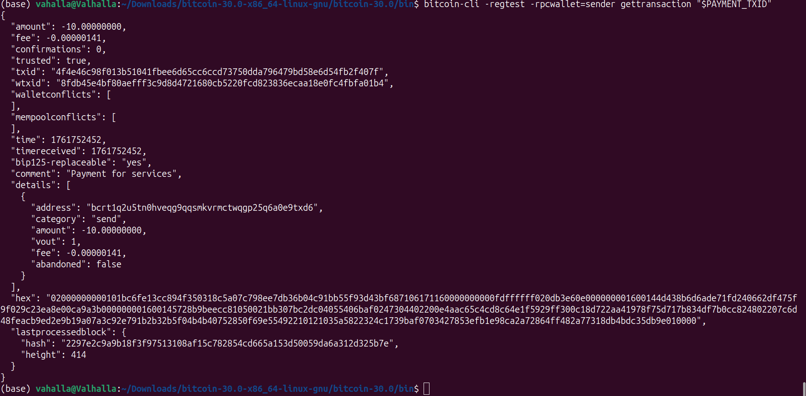
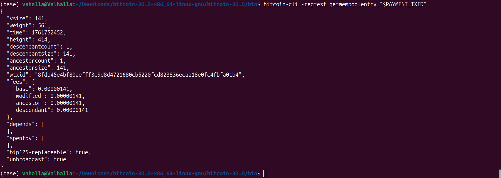
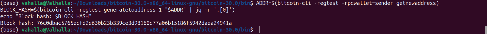
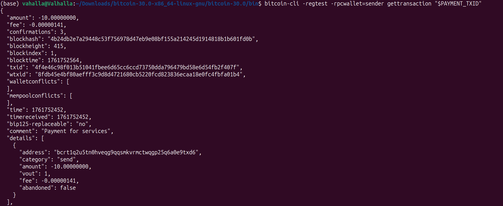
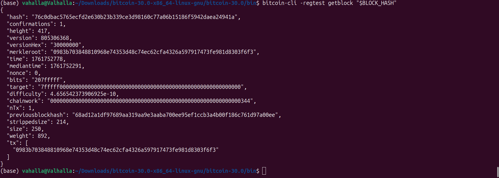

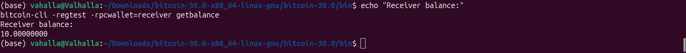
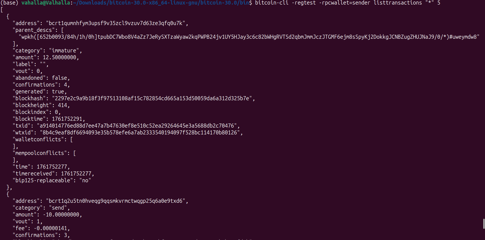
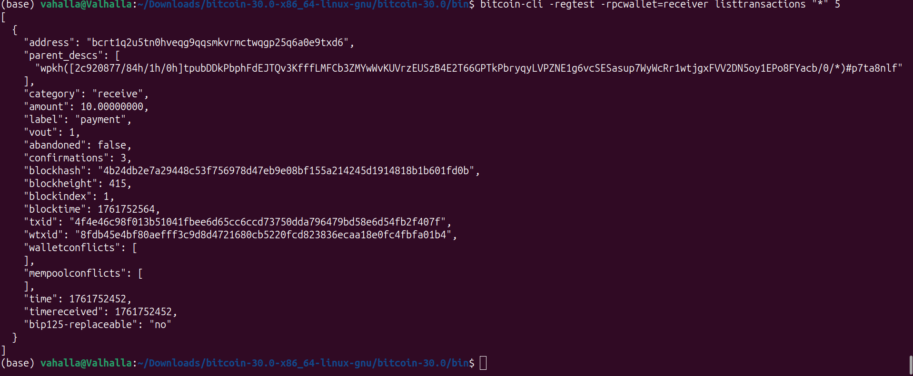
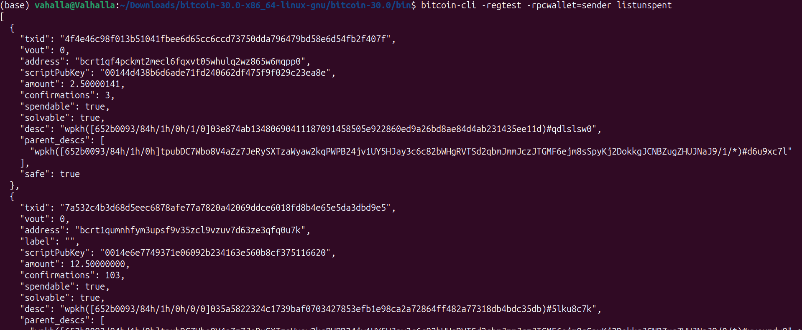
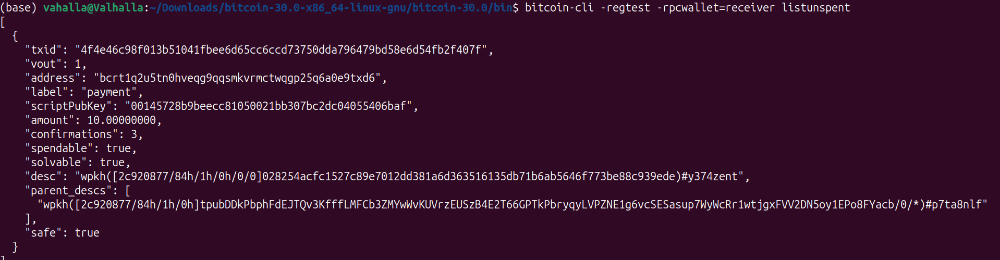