## Week 1 Assignment Solution.

1. ## successfuly setup my node and run getblockinfo.

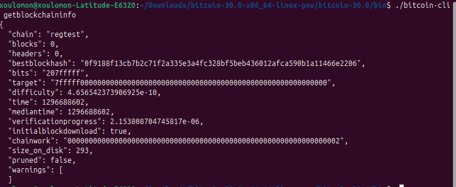

2. ## Create new wallets

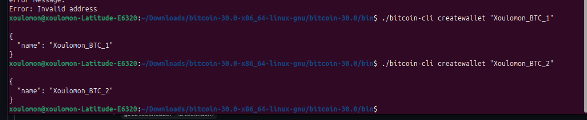
   
   ### List wallet generated

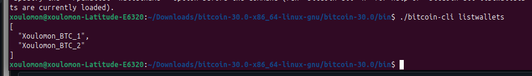

3. ## Generate 101 blocks

   > bitcoin-cli getblockcount:

   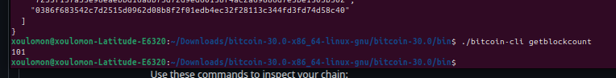

   > bitcoin-cli getblock <blockhash>

   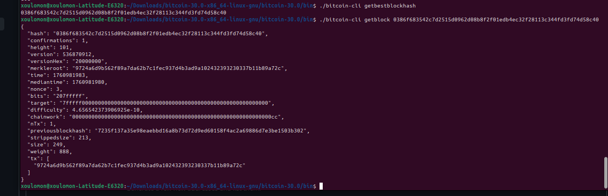

   > bitcoin-cli getblockhear <blockhash>

   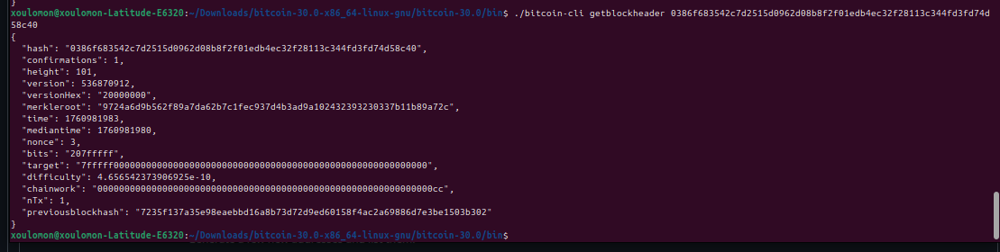

4. ## Create set of wallet

   created a new wallets

   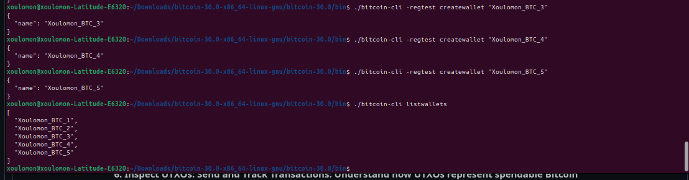

5. ## Get wallet balance, Get new address, Send to address, Get transaction

   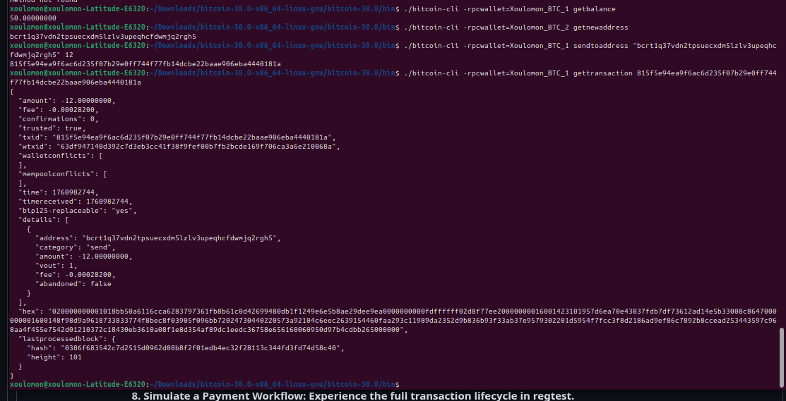

6. ## used command listunspent to view my spendable balance 

    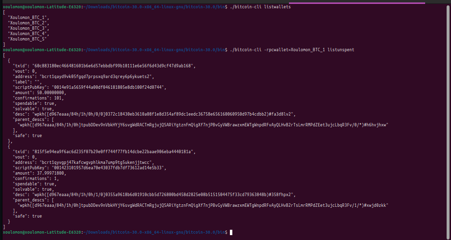

7. ## fetched transaction with gettransaction
   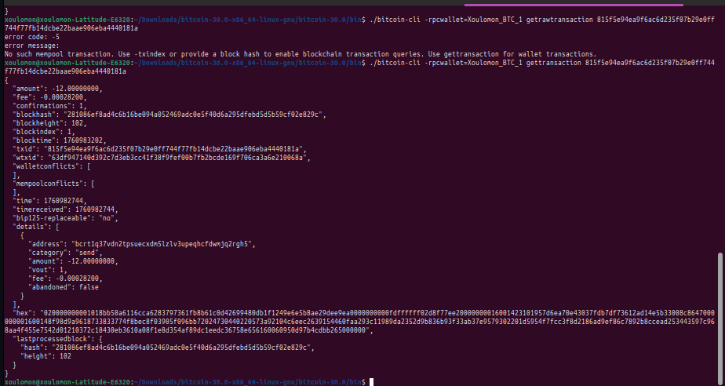

8. ## sent BTC between two wallets
> first i created two wallet named sender and receiver 

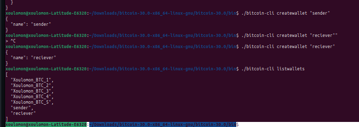

> sent BTC from sender to receiver and for the transaction to reflect in receiver's wallet, i have to mine a block.

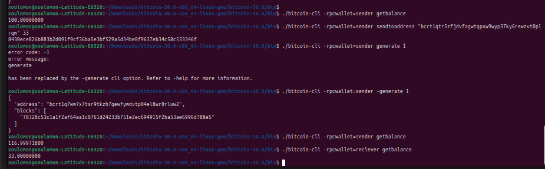

