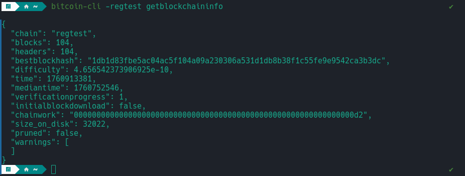
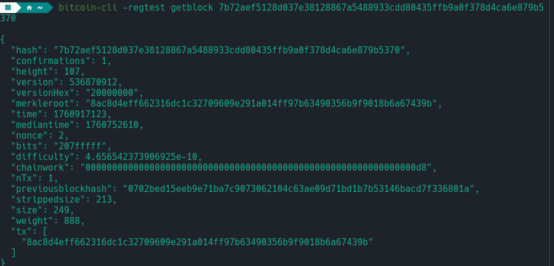
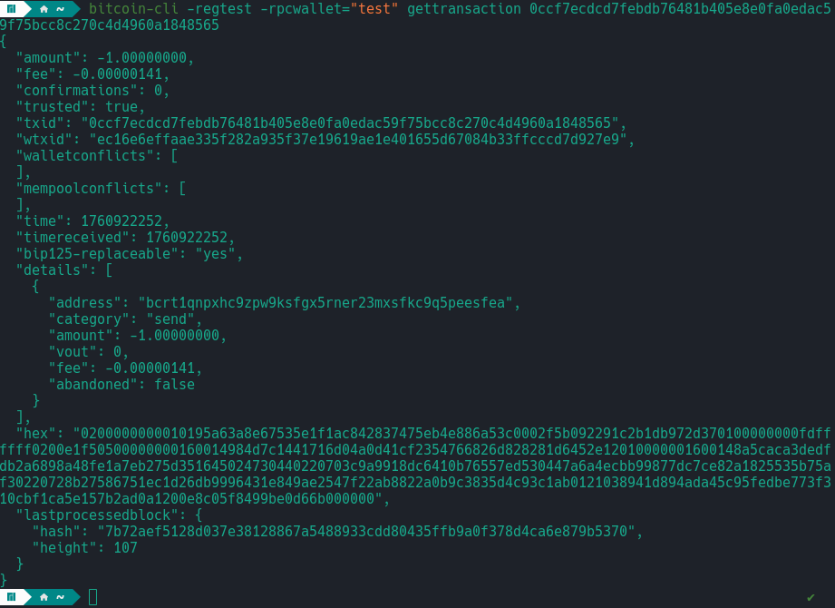
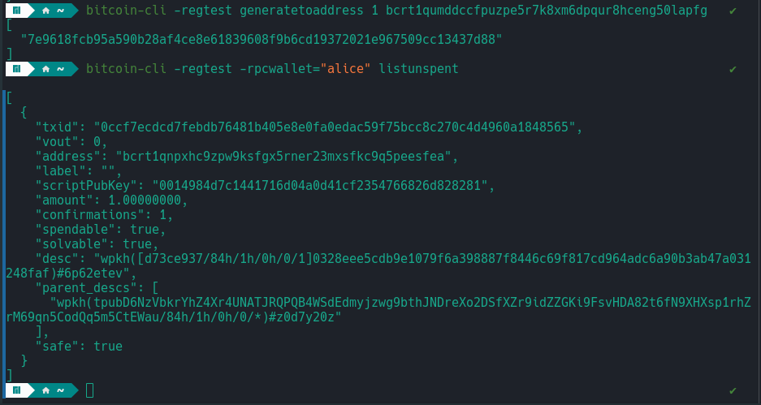

# Task 1

- Confirm that my Bitcoin Core node is running in regtest mode and responding correctly.

Command Used

`bitcoin-cli -regtest getblockchaininfo`

This command shows information about the block chain that my node is running on. it cofirms the network type(regtest in this case) and shows the current block height and status status of the chain.

# Task 2

- Verify new block height with getblockcount

Command Used
`bitcoin-cli -regtest getblockcount`

I mined 104 blocks on the regtest network to simulate how miners earn rewards. In Bitcoin, newly mined coins from a block’s coinbase transaction cannot be spent immediately; they must first mature for 100 blocks. This means that after mining the first 100 blocks, the miner can finally spend the reward. For each block mined after this maturity period, the miner receives 50 BTC (in regtest mode), which becomes spendable. This experiment helped me observe how block rewards are issued and how the coinbase maturity rule works in practice.

I created a new wallet and mined a block to observe the coinbase reward behavior. Initially, the wallet did not show the 50 BTC reward because coinbase outputs are not spendable until they reach 100 confirmations. This experiment confirmed that miners must wait for coinbase maturity before they can access their mining rewards.

# Task 3

- In this step, i explored the structure and metadata of Bitcoin blocks on the regtest network to understand how information is stored and linked.

Commands Used
`bitcoin-cli -regtest getbestblockhash`
`bitcoin-cli -regtest getblock <blockhash>`
`bitcoin-cli -regtest getblockheader <blockhash>`

`getbestblockhash` - returns the hash of the latest block (most recent) block in your block chain, more like an ID of the newest block

`getblock <blockhash>` - inspects the full block details
from this i was able to figure that each block contains:

-hash: the block’s unique identifier.

- height: the block’s position in the chain.

- time: timestamp of when the block was mined.

- merkleroot: a hash representing all transactions in the block.

- previousblockhash: reference to the previous block, ensuring the chain is unbroken.

- tx: an array of transaction IDs included in the block.

- confirmations: number of blocks added after this block.

## Insight

> I was able to differentiate between a blockheader and a full block. The block header acts like the block's ID ard, containing only the metadata such as previous block hash, merkle root, etc. In contrast, the full block contains not only this header information but also the list of all transactions included in the block, as well as additional details like size and weight.

# Task 4

- Working with wallets.
  Commands Used.
  `bitcoin-cli -regtest createwallet "testwallet"`
  `bitcoin-cli -regtest -rpcwallet="testwallet" getnewaddress`
  `bitcoin-cli -regtest listwallets`

  In this section, i explored wallet management on a Bitcoin regest node. I sstarted by creating a new wallet called `testwallet` amongst others that i created for experimental purposes.
  Once I created I generated address for the wallet

  

# Task 5

for this task, i simulated sending bitcoin between wallets in regtest to understand how transactions are created, broadcast and confirmed

- I used my wallet `test` to send 1 BTC to `alice`(I had to create a new wallet for alice) with this command

  `bitcoin-cli -regtest -rpcwallet="test" sendtoaddress bcrt1qnpxhc9zpw9ksfgx5rner23mxsfkc9q5peesfea 1`

this returned a transaction ID

`0ccf7ecdcd7febdb76481b405e8e0fa0edac59f75bcc8c270c4d4960a1848565`

- Next, i tracked the transaction ID
  `bitcoin-cli -regtest -rpcwallet="test" gettransaction 0ccf7ecdcd7febdb76481b405e8e0fa0edac59f75bcc8c270c4d4960a1848565`

  

  at this point we have 0 confirmations because it has to be included in a block.

  -At this point, I mine a block in order to confirm the transaction, after which i verified the recipient wallet for the BTC
  

  # Task 6

Understanding how bitcoin tracks spendable coins (UTXOs)
Each transaction output that hasnt been spent yet is called UTXO.

When you receive bitcoin, your wallet doest store the coins, it stores references to UTXOs (unspent output from previos transactions).

Each UTXO includes

- txid : ID of the transaction that created it
  -vout: Output index within that transaction
  -amount: value in BTC
  -confirmations: how many blocks deep it is
  -spendable: whether your wallet can use it

Commands Used

`bitcoin-cli -regtest -rpcwallet="alice" listunspent`

`[
  {
    "txid": "0ccf7ecdcd7febdb76481b405e8e0fa0edac59f75bcc8c270c4d4960a1848565",
    "vout": 0,
    "address": "bcrt1qnpxhc9zpw9ksfgx5rner23mxsfkc9q5peesfea",
    "label": "",
    "scriptPubKey": "0014984d7c1441716d04a0d41cf2354766826d828281",
    "amount": 1.00000000,
    "confirmations": 1,
    "spendable": true,
    "solvable": true,
    "desc": "wpkh([d73ce937/84h/1h/0h/0/1]0328eee5cdb9e1079f6a398887f8446c69f817cd964adc6a90b3ab47a031248faf)#6p62etev",
    "parent_descs": [
      "wpkh(tpubD6NzVbkrYhZ4Xr4UNATJRQPQB4WSdEdmyjzwg9bthJNDreXo2DSfXZr9idZZGKi9FsvHDA82t6fN9XHXsp1rhZrM69qn5CodQq5m5CtEWau/84h/1h/0h/0/*)#z0d7y20z"
    ],
    "safe": true
  }
]
`
I used the `listunspent` command to inspect all spendable UTXOs in my wallet.
Each entry represents a transaction output that hasn’t been spent yet, including the transaction ID, output index, and amount.
This confirmed that Bitcoin doesn’t track balances like a bank account — instead, it tracks individual unspent outputs that can later be combined or split when creating new transactions.

# Task 7

Commands Used

`bitcoin-cli -regtest -rpcwallet="bob" listtransactions`
`bitcoin-cli -regtest getrawtransaction 8ac8d4eff662316dc1c32709609e291a014ff97b63490356b9f9018b6a67439b  true  7b72aef5128d037e38128867a5488933cdd80435ffb9a0f378d4ca6e879b5370
`

- listtransactions returned a list

## Insight

> i was able to understand that every transaction input is a reference to a previous transaction's output. When that input is used(spent), it creates new outputs, which can later become inputs in future transactions.

## Challenge

initially trying get raw transaction alone didnt work, until i later figured, that once transaction is confirmed and in a block, Bitcoin core cant find it by txid unless i include the block hash in the command

# Task 8

For this task, i wanted to experience the complete bitcoin transaction lifecycle.

1. I created multiple wallets and also created 2 wallet addresses for these wallets.(done this in the earlier tasks)

2. Mined 101 blocks to the one of the wallet address so that their coinbase rewards would become mature and become spendable.

3. Once the sender had spendable coins, I sent 1 BTC to a receiver address

4. To confirm the transaction we have to include the transaction in a block and mine.

`   ~  bitcoin-cli -regtest -rpcwallet="test" generatetoaddress 1 "$(bitcoin-cli -regtest -rpcwallet="test" getnewaddress)"
[
  "48901b6e2ccf42eb4edcc9aa62922b40cd7d0d14b2f4c67b4a6392a0ff816f12"
]
    ~                                                                                       `

5.  Verify the payment: FInally, I checked the receiver's wallet to confirm the balance

`    ~  bitcoin-cli -regtest -rpcwallet="alice" getbalance  ✔

2.00000000
   ~  `

## Insight

> this simulation helped me understand how a completebitcoin transaction flows:

- Sender’s wallet creates a transaction referencing its UTXO as the input.

- The transaction is broadcast and then confirmed by mining a block.

- The receiver’s wallet recognizes the new UTXO (2 BTC) as its balance.
