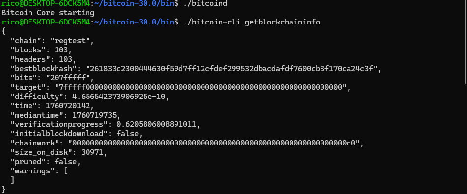

# Week 1 Assignment 

I learnt the fundamentals of the bitcoin network and how to setup a local development environment using Bitcoin core.

### 1. Startup deamon and getblockchaininfo:


### 2. GenrateBlocks:


### 3. Inspect blocks:


### 4. Multiple wallets and addresses:


### 5. Send and Track Transactions:


### 6. Inspect UTXOs:


### 7. Decode a Raw Transaction:
```
./bitcoin-cli getrawtransaction \
 "c9bbefa4d35458542603e7d9fe1b481369a2852e0e5c38a6d06b0753baa27750" \
  1 \
  "1f8dc73d3604981bb2ec987fd9a029015ddbaa7ba36af055f490bf9bcfb7121f"
