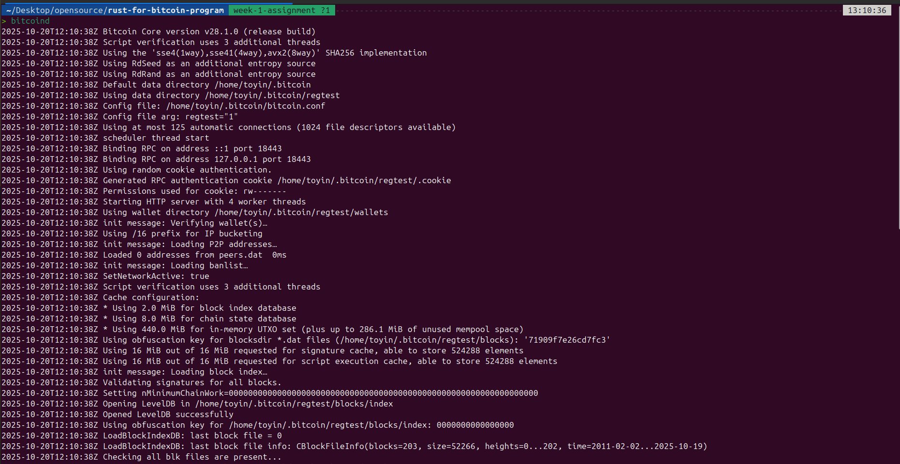
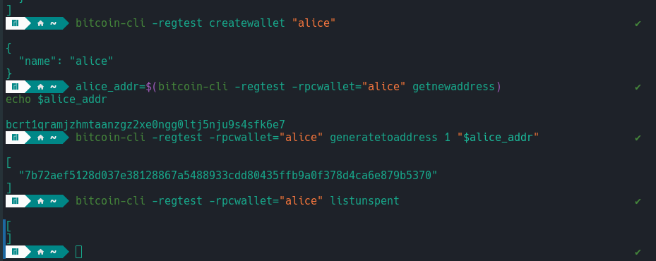
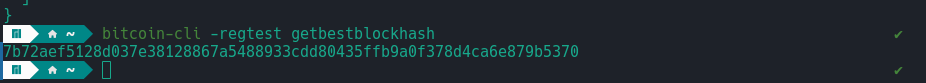
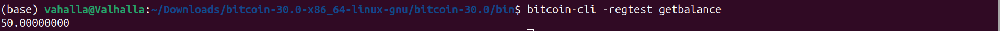
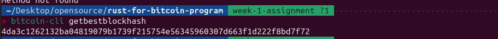

### 1. Verify Your Node Setup: Ensure your node is correctly configured and responsive via CLI.

### 2. Generate Blocks: Understand block creation and coinbase maturity on regtest.

### 3. Explore the Blockchain: Learn the structure and metadata of Bitcoin blocks.

