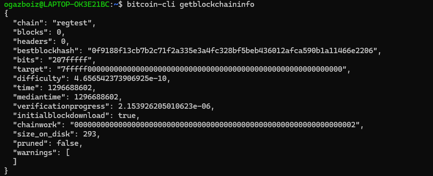
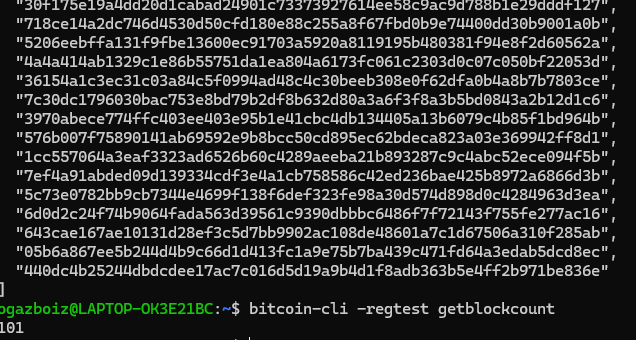
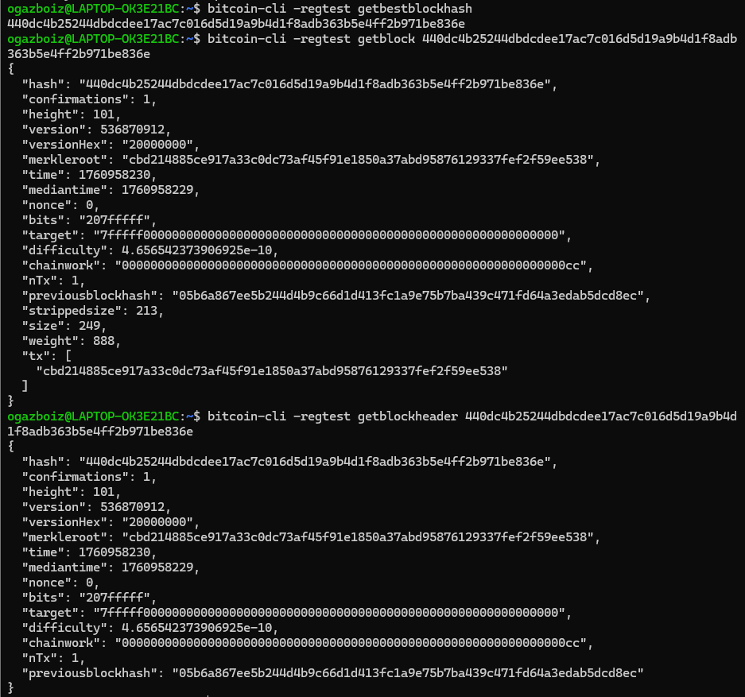
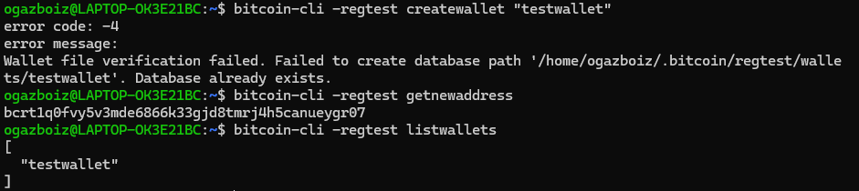
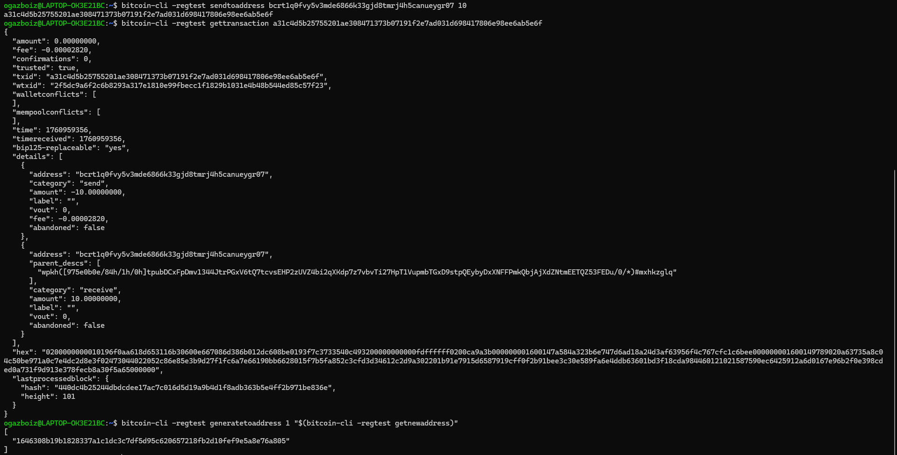
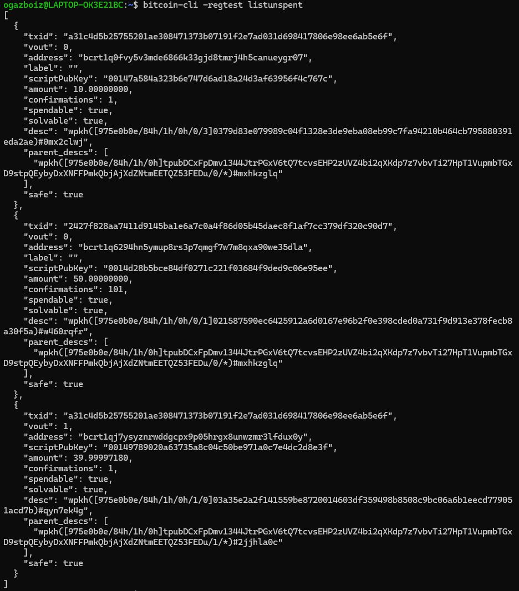
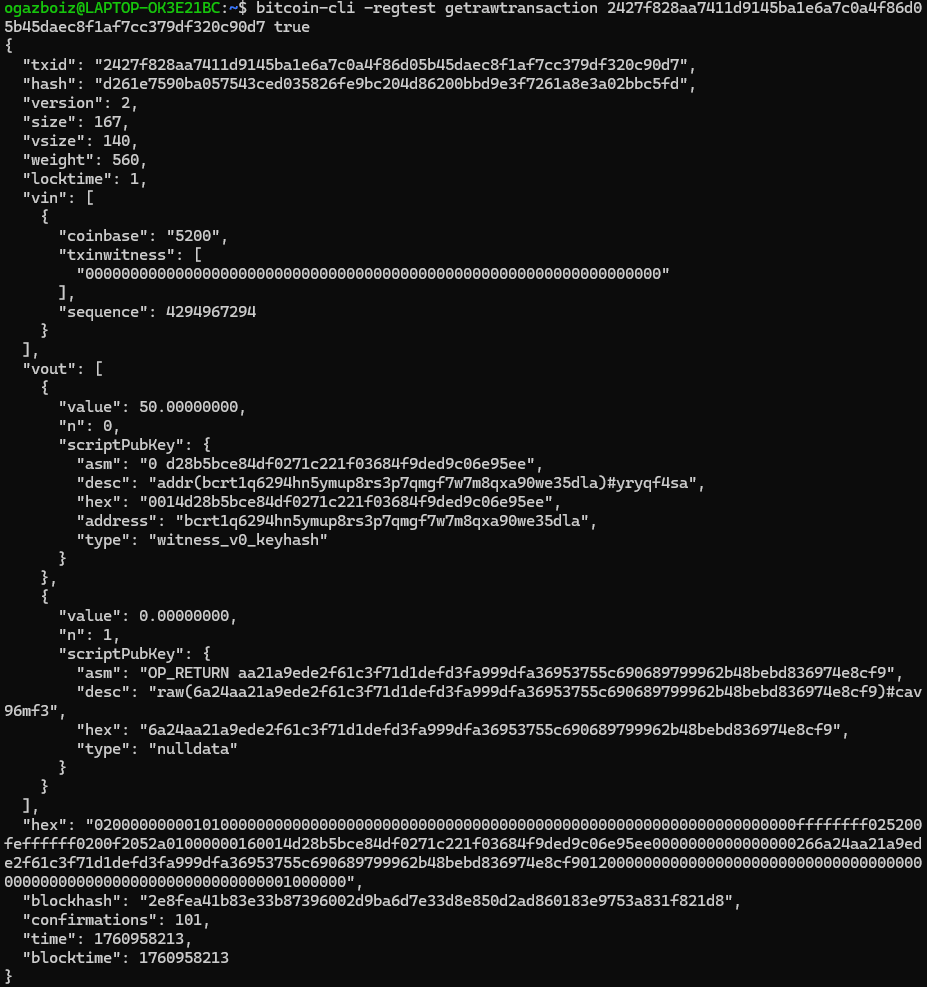
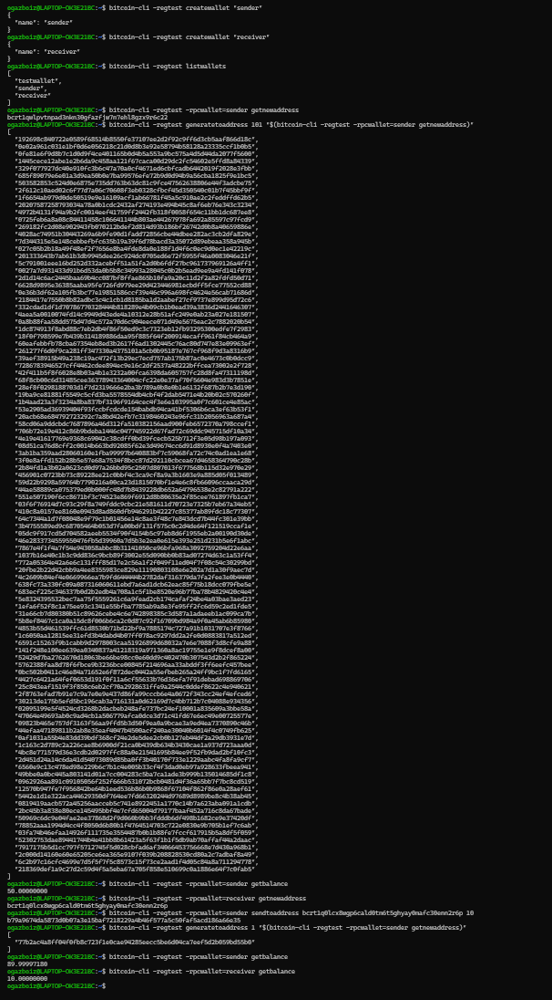
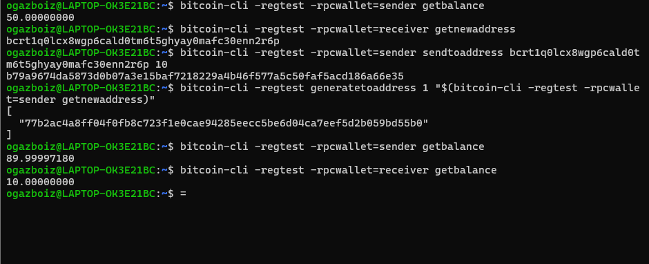

## Week 1: Bitcoin fundamentals

### Summary
I ran a Bitcoin Core node in regtest. I generated blocks, managed wallets, sent transactions, and inspected the chain. I kept everything local and fast.

### Step 1: Node setup
I ran:

```bash
bitcoin-cli getblockchaininfo
```

I confirmed:

- chain: regtest
- blocks showed my current count



### Step 2: Generate blocks
I ran:

```bash
bitcoin-cli -regtest createwallet "testwallet"
bitcoin-cli -regtest loadwallet "testwallet"
bitcoin-cli -regtest generatetoaddress 101 "$(bitcoin-cli -regtest getnewaddress)"
bitcoin-cli -regtest getblockcount
```

I generated 101 blocks.



### Step 3: Explore the chain
I ran:

```bash
bitcoin-cli -regtest getbestblockhash
bitcoin-cli -regtest getblock BLOCKHASH
bitcoin-cli -regtest getblockheader BLOCKHASH
```



### Step 4: Wallets and addresses
I ran:

```bash
bitcoin-cli -regtest listwallets
bitcoin-cli -regtest createwallet "testwallet"
bitcoin-cli -regtest loadwallet "testwallet"
bitcoin-cli -regtest getnewaddress
```



### Fee estimation error fix
If I saw:

> Fee estimation failed. Fallbackfee is disabled.

I started the node with:

```bash
bitcoind -regtest -fallbackfee=0.0002 -txindex=1
```

This enabled fallback fees and an index for raw lookups.

### Step 5: Send and confirm
I ran:

```bash
bitcoin-cli -regtest sendtoaddress RECEIVER_ADDRESS 10
bitcoin-cli -regtest gettransaction TXID
bitcoin-cli -regtest generatetoaddress 1 "$(bitcoin-cli -regtest getnewaddress)"
```



### Step 6: Inspect UTXOs
I ran:

```bash
bitcoin-cli -regtest listunspent
```

I tracked:

- txid
- vout
- amount



### Step 7: Decode a raw transaction
I ran:

```bash
bitcoin-cli -regtest getrawtransaction TXID true
```

If I saw “No such mempool transaction,” I ensured my node started with `-txindex=1`.



### Step 8: Simulate a payment workflow
I ran:

```bash
bitcoin-cli -regtest createwallet "sender"
bitcoin-cli -regtest createwallet "receiver"
bitcoin-cli -regtest -rpcwallet=sender getnewaddress
bitcoin-cli -regtest -rpcwallet=sender sendtoaddress RECEIVER_ADDRESS 5
bitcoin-cli -regtest generatetoaddress 1 "$(bitcoin-cli -regtest -rpcwallet=sender getnewaddress)"
```





### Common fixes

| Issue | Fix |
| --- | --- |
| No wallet loaded | `bitcoin-cli -regtest loadwallet "testwallet"` |
| Fallbackfee is disabled | Start node with `-fallbackfee=0.0002` |
| No such mempool transaction | Start node with `-txindex=1` |

### What I learned

- How UTXOs define spendable balance
- How wallets, fallback fees, and mempool behavior affect sends
- How to explore blocks, headers, and raw transactions
- How to simulate end to end payments on regtest
