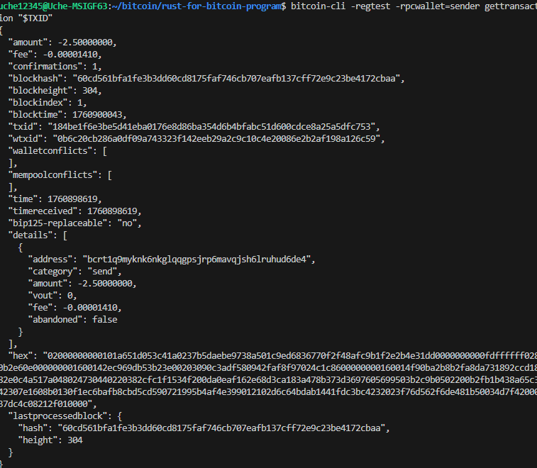

# Week 1 — Bitcoin Fundamentals (Lab Report)

This week, I worked through Bitcoin Core exercises in regtest mode to understand the fundamentals of transactions, wallets, and the blockchain. Here's what I accomplished.

## Verifying the Node

First, I verified that my Bitcoin node was running correctly in regtest mode:

```
bitcoin-cli -regtest getblockchaininfo
```

I checked that the `chain` parameter showed `regtest` and noted the current block height.


## Creating a Spendable Coinbase

To work with actual transactions, I needed to mine blocks so the coinbase rewards would mature. I mined 101 blocks to ensure the coinbase was spendable after reaching 100 confirmations:

```
bitcoin-cli -regtest generatetoaddress 101 "$(bitcoin-cli -regtest -rpcwallet=testwallet getnewaddress)"
```


## Exploring Block Data

With blocks now on the chain, I explored the structure of the blockchain by examining block information:

```
bitcoin-cli -regtest getbestblockhash
bitcoin-cli -regtest getblock <blockhash>
bitcoin-cli -regtest getblockheader <blockhash>
```

This helped me understand how block data is organized and stored.


## Setting Up Multiple Wallets

For the payment workflow simulation, I created three separate wallets:

```
bitcoin-cli -regtest createwallet "testwallet"
bitcoin-cli -regtest createwallet "sender"
bitcoin-cli -regtest createwallet "receiver"
```

Then I generated new addresses for each wallet:

```
bitcoin-cli -regtest -rpcwallet=testwallet getnewaddress
bitcoin-cli -regtest -rpcwallet=sender getnewaddress
bitcoin-cli -regtest -rpcwallet=receiver getnewaddress
```


## Understanding Transactions

I created and tracked transactions to see how they work at both the wallet and blockchain levels. For a simple transaction, I generated a new address and sent funds to it:

```
RECV=$(bitcoin-cli -regtest -rpcwallet=testwallet getnewaddress)
TXID=$(bitcoin-cli -regtest -rpcwallet=testwallet sendtoaddress "$RECV" 1.0)
echo "TXID: $TXID"
```

I then examined the transaction using two different commands to understand wallet-level and chain-level details:

```
bitcoin-cli -regtest -rpcwallet=testwallet gettransaction "$TXID"
bitcoin-cli -regtest getrawtransaction "$TXID" true
```

Key fields I observed included the transaction ID, net amount change, fees, and confirmation count.



## Examining UTXOs

To see the unspent outputs in the receiver's wallet, I ran:

```
bitcoin-cli -regtest -rpcwallet=receiver listunspent
```

This showed me the available coins that the receiver could spend in future transactions.


## Simulating a Complete Payment Workflow

To bring everything together, I decided to simulate a realistic payment scenario from start to finish. Here's what I did:

**Step 1:** I created multiple wallets (a sender and receiver) and generated addresses for each. I'd already done this in the earlier tasks.

**Step 2:** I mined 101 blocks to one of my wallet addresses so that the coinbase rewards would mature and become spendable.

**Step 3:** Once the sender had spendable coins, I sent 1 BTC to the receiver's address using:

```
bitcoin-cli -regtest -rpcwallet=sender sendtoaddress "<receiver_address>" 1.0
```


**Step 4:** To finalize the transaction, I needed to include it in a block by mining:

```
bitcoin-cli -regtest -rpcwallet="test" generatetoaddress 1 "$(bitcoin-cli -regtest -rpcwallet="test" getnewaddress)"
```

This produced a new block hash, confirming the transaction was now part of the chain.

**Step 5:** Finally, I verified the payment went through by checking the receiver's balance:

```
bitcoin-cli -regtest -rpcwallet="receiver" getbalance
```

The receiver's wallet showed a balance of 2.00000000 BTC, confirming the payment was successful.

## Key Insights

This hands-on simulation gave me a clear understanding of the complete Bitcoin transaction lifecycle:

- **Transaction Creation:** The sender's wallet creates a transaction that references its UTXO as input and specifies the receiver's address as output.

- **Broadcasting and Mining:** Once created, the transaction enters the mempool and waits for a miner to include it in a block. Mining that block confirms the transaction.

- **Wallet Recognition:** Once confirmed, the receiver's wallet recognizes the new UTXO as spendable funds, and their balance updates accordingly.

This practical experience showed me how Bitcoin transactions flow through the network—from creation in a wallet, through confirmation via mining, to final settlement in a recipient's wallet.