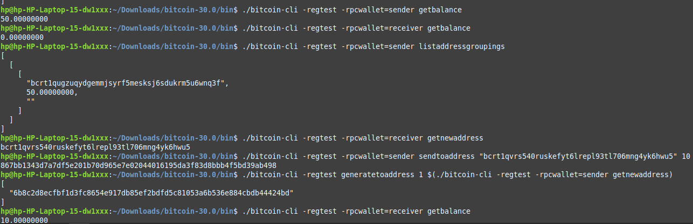

# Week 1 Assignment - Bitcoin Fundamentals :rocket:

## ✅ Verification of Bitcoin Core Node setup - in `regtest mode`

- First I downloaded the bitcoin package from [Bitcoin Core page](https://bitcoincore.org/en/download/) and I added the command below to the `bitcoin.conf` to ensure that the node was running in regtest mode and daemon just makes sure that logs are not shown when the node is starting
```bash
regtest=1
daemon=1
```
- Then, I used the command `./bitcoind` to start the bitcoin node and `./bitcoin-cli getblockchaininfo ` to get the details of the node

")

## ✅ Generating Blocks on `regtest`

- I used the command `./bitcoin-cli -regtest generatetoaddress 101 "$(./bitcoin-cli -regtest getnewaddress)` 

- Here, I got the balance using `./bitcoin-cli -regtest getbalance` and the blockcount using the command `./bitcoin-cli -regtest getblockcount`. 
- The `balance` reads `50` because the block reward for mining a block is 50BTC and can only be gotten after the next 100 blocks have been mined and the `blockcount` reads `203` because I previously mined 102 blocks with another address 


## ✅ Exploring the Blockchain - The structure and metadata of Bitcoin blocks

I used some commands to inspect some of the details of the chaib such as the `bestblockhash`the `block` and the `blockheader`

- I was able to read the best block hash using the `./bitcoin-cli -regtest getbestblockhash` command and it return a hesadecimal value which represents the hash of the most recently added and validated block in the Bitcoin network.
- I also retrieved the block that belongs to the block hash using the  `getblock` command which uses the `blockhash` as a required parameter `/bitcoin-cli -regtest getblock "0a186c198238e2bdccb6039e4a50f5a5fef83b0f6bab94976dda07f367ef4d55"` It retuurned a JSON object that contained dome details of the block such as the height, hash, vesrions, nonce, confirmations e.t.c

- I read the blockheader of the block also using the blockhash as a parameter with the command `./bitcoin-cli -regtest getblockheader "0a186c198238e2bdccb6039e4a50f5a5fef83b0f6bab94976dda07f367ef4d55"` and it returned about the blockheader. The blockheader simply contains metadata or summary of a particular block

> :bulb: What I noticed is that the blockheader returns the same information that the block returns but the blockheader omits the `strippedSize`, `size`,`weight` and `tx` fields. 


## ✅ Working with Wallets and Addresses

#### Creating a wallet
- I created a wallet using the command `./bitcoin-cli createwallet "assignment1"` and it returned

```
{
  "name": "assignment1"
}
```
#### Creating an address
- To create and address for a wallet that has just been created, you use the command `./bitcoin-cli -regtest -rpcwallet=assignment1 getnewaddress` and it returns an Bitcoin address.

#### Multiple Wallets
For operating with multiple wallets, you have to specify the wallet that is carrying out an operation using the `-rpcwallet`command
> For example, if I wanted to create another wallet `assignment2` and create an address linked to that wallet; I would first of all create the wallet using this commmand `./bitcoin-cli createwallet "assignment2"` and create the address for this wallet using the command `./bitcoin-cli -regtest -rpcwallet=assignment2 getnewaddress`

#### Wallet Info
You could get the information for a created wallet using the command `./bitcoin-cli -regtest -rpcwallet=assignment1 getwalletinfo` and if would return information tied to that wallet


> ⚠️ NOTE: If you had a single wallet, the command would be `./bitcoin-cli -regtest getwalletinfo`

#### Listing Addresses 
You use the command `./bitcoin-cli -regtest listaddressgroupings` for listing addresses that have been involved in transactions and the command `./bitcoin-cli -regtest listreceivedbyaddress 0 true` for listing addresses that have not been involves in any transaction as well as those that have.


## ✅ Sending and Tracking Transactions

To send test coins to another address you have to use the `sendtoaddress` command 
```
./bitcoin-cli -regtest sendtoaddress <recipient_address> <amount>
```

However, when I tried this, I had an error ⚠️

This is because, fallback fee is disabled by default so I had to enable it by setting a fallback fee in my `bitcoin.conf` file by adding and restarting the node
```bash
fallbackfee=0.00001
```


- After restarting the node, I was able to make the transaction (which returned a transaction hash) and get the transaction details usimg the `gettransction` command.

## ✅ Inspecting and understanding UTXOs
- Initially, when I checked my spendable outputs using the `listunspent` command, it returned an empty array.

> 💡 Then I understood that, the `listunspent` command only returned UTXOs that were confirmed, that means, my transactions were not confirmed yet (still in the mempool). And for my trnsactions to be confirmed, I needed to mine a block!


 
After I mined a block, the `listunspent` command  returned the UTXOs containing details like `txid`, `vout`,`address`, `amount` e.t.c

## ✅ Decoding Raw Transactions - Understanding Bitcoin's transaction model

- I learnt that to fetch raw transactions, you needed to use the `blockhash` of that transaction as a parameter and the `verbosity` (to determine the format of display of information - 0,1 or 2)
- When I initially tried to fetch the raw transaction, it returned an error


- I noticed that using the `getrawtransaction` command provided additional details like `vin`, `vout` which represent the input and output struture of transactions. The `vout` section had 2 parts that represents the value that was sent and the value that was returned as change.


## ✅ Payment Workflow Simulation

- I simulated a payment workflow by creating two wallets the `sender` and the `receiver`. I created addresses for each wallet and attempted to make transactions between them

 Creating the `sender` and `receiver` wallets and mining blocks to a new address in the sender wallet


- Verifying the balance in the wallets
- Creating a new address for the receiver wallet 
- Sending 10 coins from the sender to the receiver
- Mined a block to confirm the transaction
- Verified the balance of the receiver to be 10



- Getting the transaction details using the `gettransaction` command
- Verified that the transactionis confirmed because the `confirmations` field is `1`


- Getting the raw transaction details using the `getrawtransaction` command with the blockhash
- Verified that the transactionis confirmed because the `in_active_chain` field is `true`
