## Node Setup 
Verified that my Bitcoin node is running in regtest mode.

```bash 
./bitcoin-cli -regtest getblockchaininfo
```


## Block Generation
Generated 101 blocks to a new address to obtain spendable test coins.

```bash
bitcoin-cli -regtest getnewaddress
bitcoin-cli -regtest generatetoaddress 101 <my_new_address>
bitcoin-cli -regtest getblockcount
```

Output
407

> My chain now has 407 blocks in total.The first 100 blocks matured the coinbase rewards; I now have usable test BTC.

## Explore The Blockchain
Checked the latest block:

```bash
bitcoin-cli -regtest getbestblockhash
bitcoin-cli -regtest getblock <blockhash>
bitcoin-cli -regtest getblockheader <blockhash>
```
**Observations**


`getbestblockhash` asks your Bitcoin node `"what is the hash of the most recent block on the blockchain"`
`getblock` shows details like height, size, tx, previousblockhash, and confirmations.

`getblockheader` shows header-level metadata such as version, merkleroot, time, and bits.
It is a smaller summary of the block’s metadata. These commands helped me understand the structure of Bitcoin blocks. 

## Wallet operation
Created a new wallet named testwallet and generated addresses.
```bash
bitcoin-cli -regtest createwallet "testwallet"
bitcoin-cli -regtest listwallets
bitcoin-cli -regtest getnewaddress
bitcoin-cli -regtest getnewaddress
```
Output

Each wallet can manage its own set of addresses and keys.

## Transactions

Sent 1.5 BTC to a new address and checked the transaction details.
```bash
bitcoin-cli -regtest sendtoaddress <receiver_address> 1.5
bitcoin-cli -regtest gettransaction <txid>
```

## Output fields observed:

`amount`: -1.5 BTC (from sender wallet)
`fee`: small negative value (~0.00001 BTC)
`confirmations`: 0 (initially unconfirmed)
Transaction created and visible in the mempool until a new block is mined.

## UTXO Inspection

Viewed my spendable outputs with:
```bash
bitcoin-cli -regtest listunspent
```

Output
```bash
[
  {
    "txid": "a1234ef...abcd",
    "vout": 0,
    "address": "bcrt1qxyz...",
    "amount": 1.56250000,
    "confirmations": 103,
    "spendable": true
  }
]
```
Each UTXO represents a specific amount of Bitcoin that can be spent in a future transaction.

## Decode a Raw Transaction
Fetched and decoded a raw transaction:
```bash
bitcoin-cli -regtest getrawtransaction <txid> true
```
**Key parts:**
`vin` (inputs): references previous UTXOs by txid and vout.
`vout` (outputs): creates new UTXOs with specific amounts and addresses.
`hex` field: the serialized transaction data.
Understanding vin and vout clarified how Bitcoin transactions are chained.

## Payment Workflow Simulation
Created two wallets and simulated a payment.
```bash
bitcoin-cli -regtest createwallet "sender"
bitcoin-cli -regtest createwallet "receiver"

# get addresses
bitcoin-cli -regtest -rpcwallet="receiver" getnewaddress
bitcoin-cli -regtest -rpcwallet="sender" getnewaddress

# send 0.5 BTC
bitcoin-cli -regtest -rpcwallet="sender" sendtoaddress <receiver_address> 0.5

# mine one block to confirm
bitcoin-cli -regtest generatetoaddress 1 <any_address>
```

```bash

bitcoin-cli -regtest -rpcwallet="sender" getbalance
bitcoin-cli -regtest -rpcwallet="receiver" getbalance
```
Sender’s balance decreased by 0.5 BTC (+ fee); Receiver’s balance increased by 0.5 BTC after confirmation.


**What I Learned**
- How to run Bitcoin Core in regtest mode and generate blocks locally.
- The structure and metadata of Bitcoin blocks and transactions.
- How UTXOs represent spendable Bitcoin and enable secure transactions.
- How wallets create and broadcast transactions on the network.

### Step 1

Verified Node setup


Created new test wallet first So i could generate blocks to new address (Method had been updated so wallet has to be made manually)

"name": "deesfinalstraw"

Generated New address
bcrt1qey7m0qkgmjh7swu5r22mlkc4j22n3fzvd5g4kg

```

```

### Step 2

#### Step 2a

Generated 101 blocks to new Address


#### Step 2b

Verified the BlockCount


### Step 3

#### Step 3a

Got the blockhash


#### Step 3b

Get the best block hash

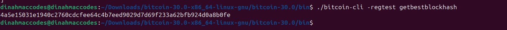

#### Step 3c

Get a specific block using a blockhash

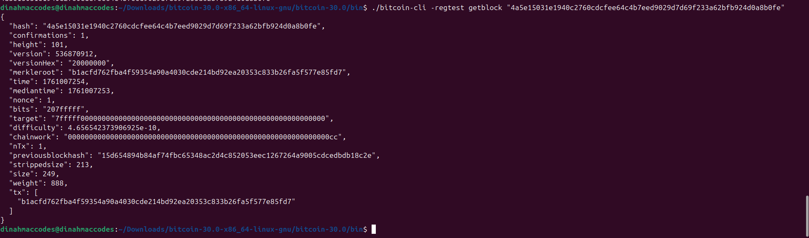

#### Step 3d

Get a specific blockheader using the blockhash
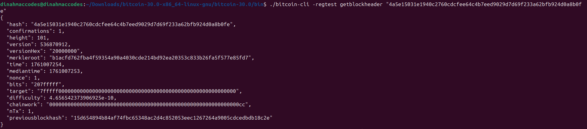

#### Step 4a

Generate new wallets

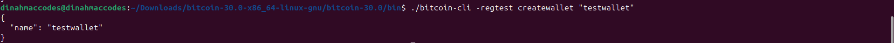

#### Step 4b

Generate new addresses

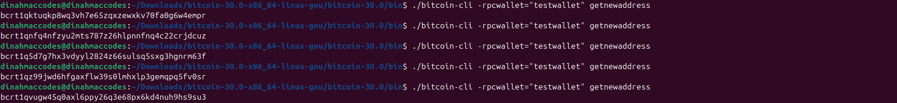

#### Step 4c

List them all

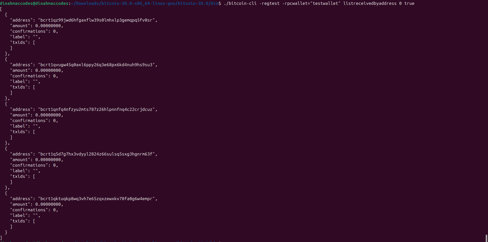

#### Step 5a

Send Transactions

Cannot send funds in regtest without mining blocks first so the fee can be calculated.
So the first step is to fund the wallet, mine blocks to estimate the fee then send bitcoin to the address
This has been done previously so I will move onto the process of sending transactions to the address of my choice

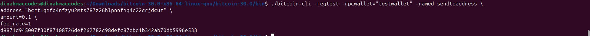

Transaction id was displayed

#### Step 5b

Track Transactions

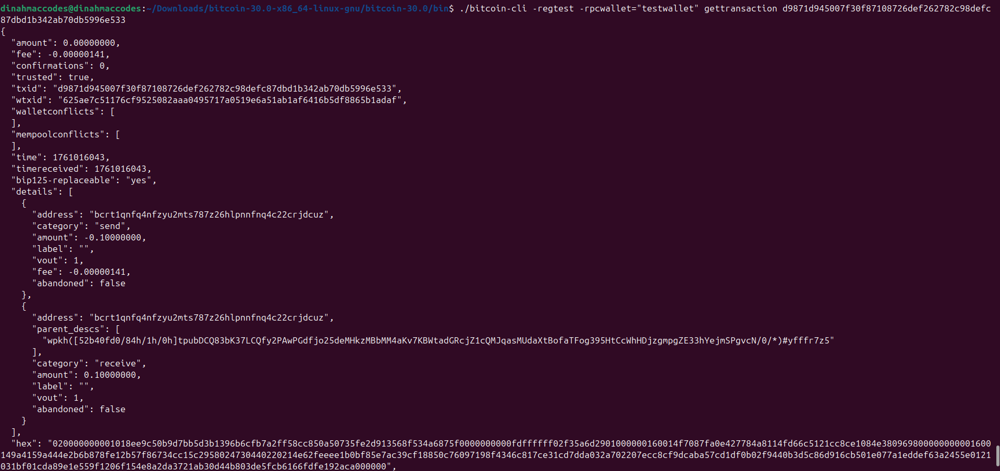

#### Step 6

Tried to listunspent but got an empty slate
I realized the listunspent shows UTXOs with at least one confirmation
So I decided to mine a block. This will make the previous transaction move off the mempool so it will be included into a mined block


#### Step 6a

Now if I check with listunspent, it should work
Here are the transaction details txid, vout, and amount
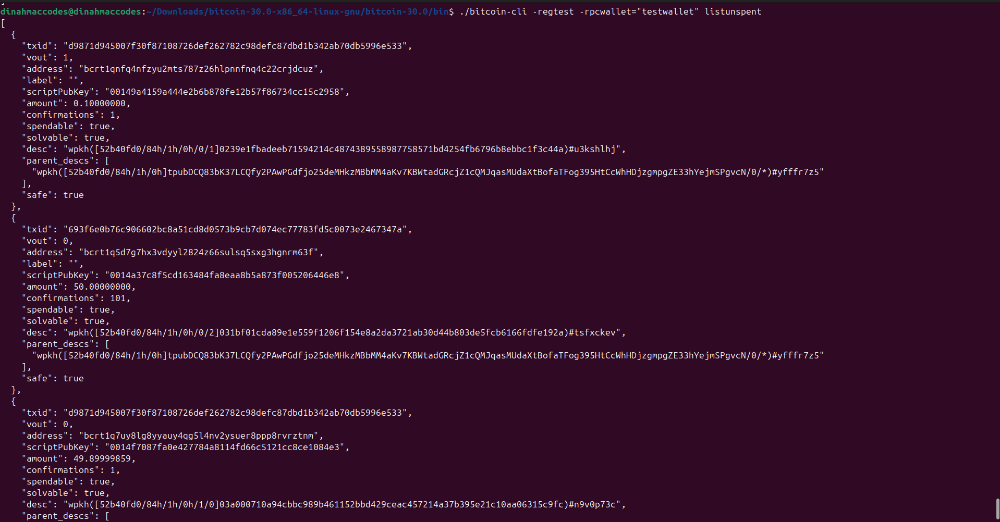

### Step 7

Get raw transaction
To get raw transaction, blockhash has to be gotten also.
So I generated it by using listunspent

Then I used the gettransaction command to get the blockhash

./bitcoin-cli -regtest -rpcwallet="testwallet" gettransaction TX-ID

The blockhash will also be generated in the Output

#### Step 7a

Getting the actual raw transaction

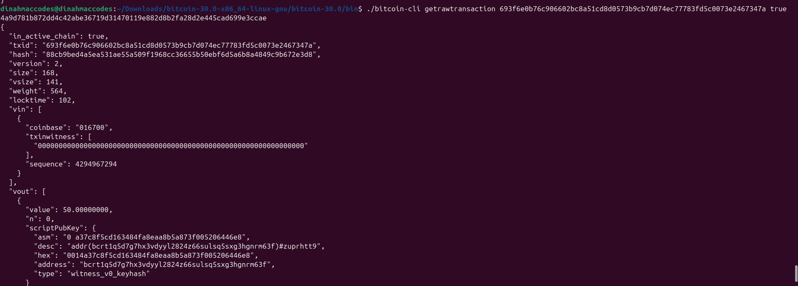
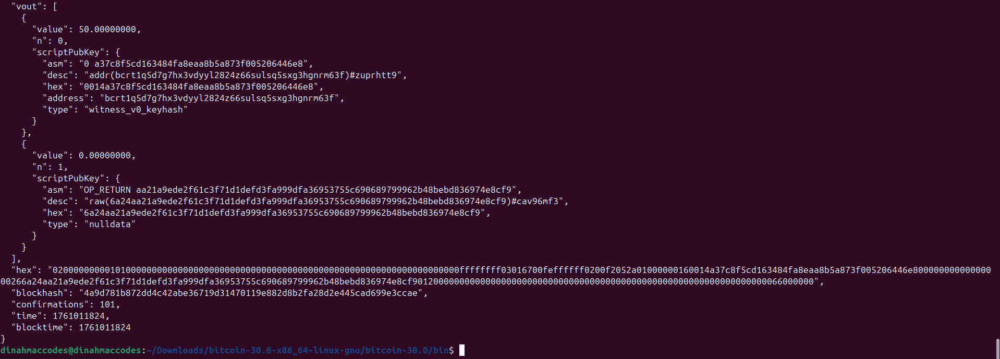

### Step 8

Simulate payment flow

#### Step 8a

Create sender wallet and receiver wallet

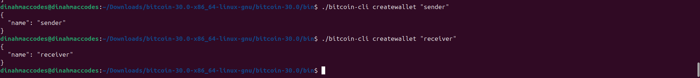

Create addresses for both sender and receiver wallets


#### Step 8c

Send BTC from sender to receiver
Got the error of insufficient funds so had to mine blockd greater than 100 first to the sender address so there will be BTC sent to it

Now I can send BTC from sender to receiver address

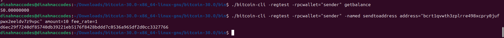

#### Step 8d

Confirm the transaction by mining a block Confirm the transaction by mining a block

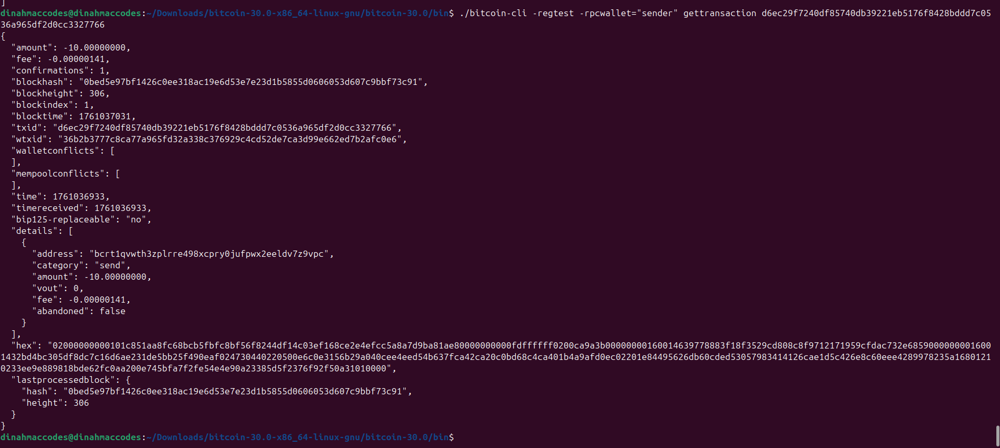

