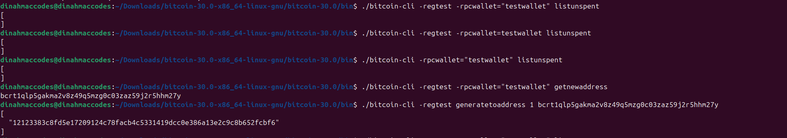
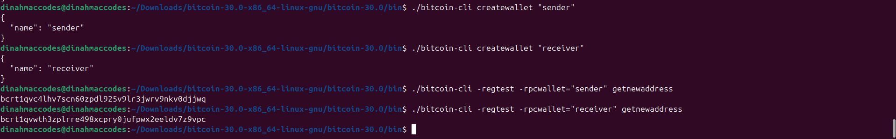

So I start off here

### Step 1

Verified Node setup


Created new test wallet first So i could generate blocks to new address (Method had been updated so wallet has to be made manually)

"name": "deesfinalstraw"

Generated New address
bcrt1qey7m0qkgmjh7swu5r22mlkc4j22n3fzvd5g4kg

```

```

### Step 2

#### Step 2a

Generated 101 blocks to new Address


#### Step 2b

Verified the BlockCount


### Step 3

#### Step 3a

Got the blockhash


#### Step 3b

Get the best block hash


#### Step 3c

Get a specific block using a blockhash


#### Step 3d

Get a specific blockheader using the blockhash


### Step 4

#### Step 4a

Generate new wallets


#### Step 4b

Generate new addresses


#### Step 4c

List them all


#### Step 5a

Send Transactions

Cannot send funds in regtest without mining blocks first so the fee can be calculated.
So the first step is to fund the wallet, mine blocks to estimate the fee then send bitcoin to the address
This has been done previously so I will move onto the process of sending transactions to the address of my choice


Transaction id was displayed

#### Step 5b

Track Transactions


#### Step 6

Tried to listunspent but got an empty slate
I realized the listunspent shows UTXOs with at least one confirmation
So I decided to mine a block. This will make the previous transaction move off the mempool so it will be included into a mined block



#### Step 6a

Now if I check with listunspent, it should work
Here are the transaction details txid, vout, and amount


### Step 7

Get raw transaction
To get raw transaction, blockhash has to be gotten also.
So I generated it by using listunspent

Then I used the gettransaction command to get the blockhash

./bitcoin-cli -regtest -rpcwallet="testwallet" gettransaction TX-ID

The blockhash will also be generated in the Output

#### Step 7a

Getting the actual raw transaction


### Step 8

Simulate payment flow

#### Step 8a

Create sender wallet and receiver wallet


Create addresses for both sender and receiver wallets



#### Step 8c

Send BTC from sender to receiver
Got the error of insufficient funds so had to mine blockd greater than 100 first to the sender address so there will be BTC sent to it

Now I can send BTC from sender to receiver address


#### Step 8d

Confirm the transaction by mining a block Confirm the transaction by mining a block


